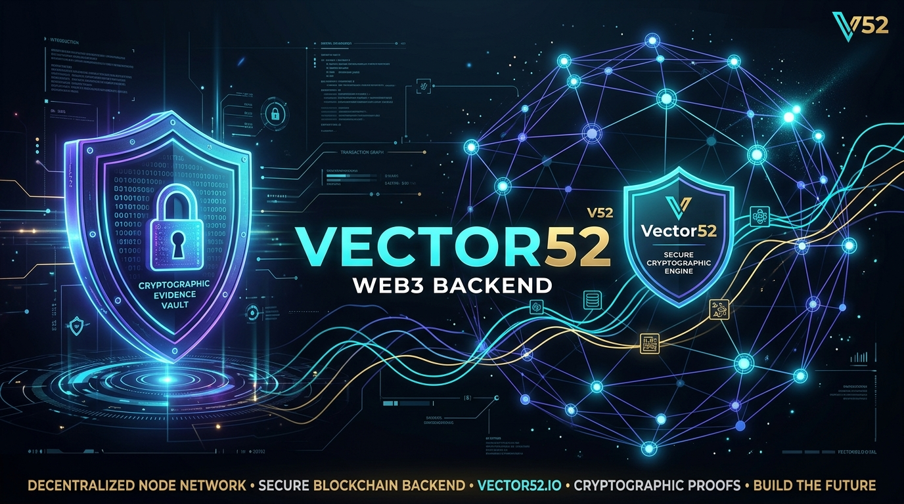
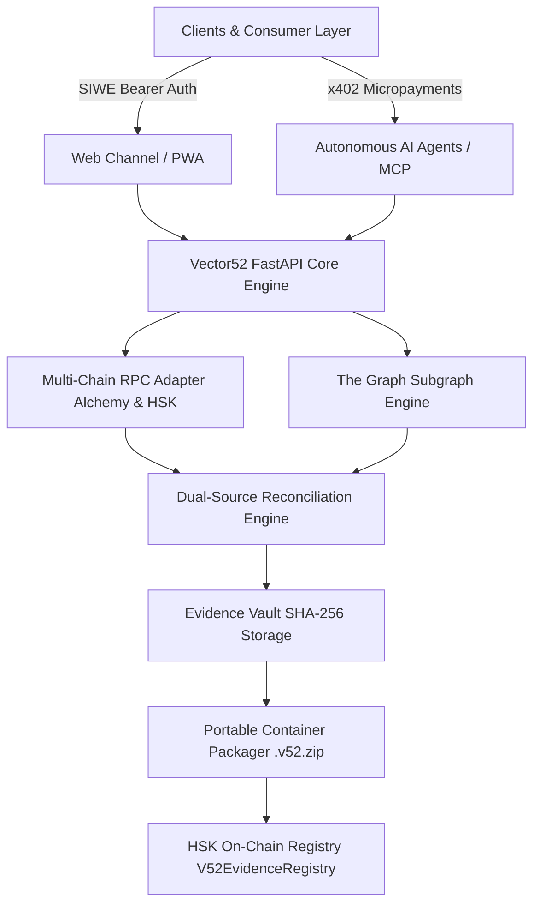
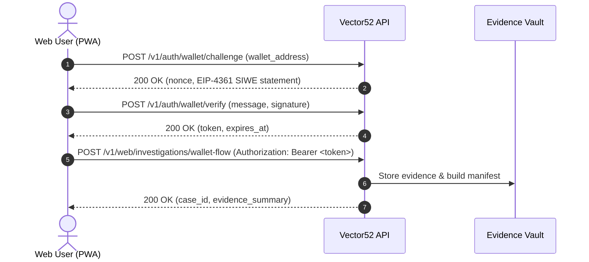
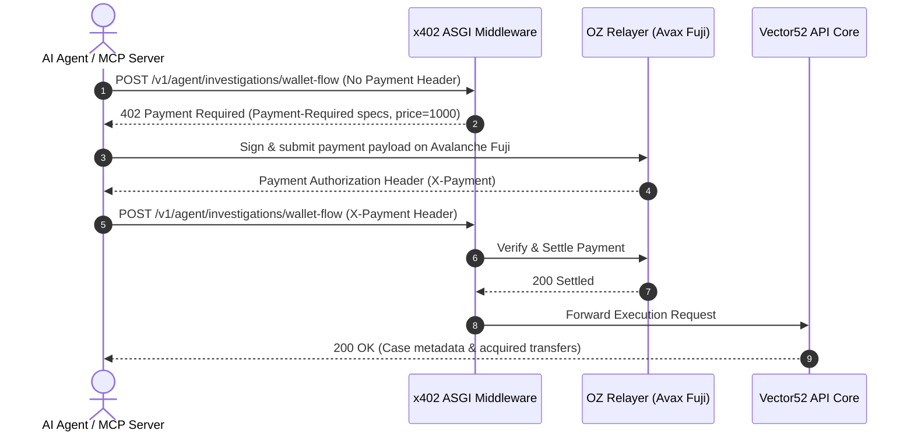

<div align="center">

# 🛡️ Vector52 Backend — Evidence-First Web3 Claim Auditor

**"Don't just trace the money. Prove the claim."**

[](https://www.python.org/)
[](https://fastapi.tiangolo.com/)
[](https://web3py.readthedocs.io/)
[](https://x402.org/)
[](https://testnet.hsk.xyz/)
[](https://subnets.avax.network/c-chain)
[](https://thegraph.com/)
[](LICENSE)
[](#7-testing--code-quality)

</div>

---

## 📑 Table of Contents

1. [Executive Summary](#-executive-summary)
2. [Key Capabilities & Architecture](#-key-capabilities--architecture)
   - [Dual-Channel Access Model](#1-dual-channel-access-model)
   - [Multi-Source Data Engine & Reconciliation](#2-multi-source-data-engine--reconciliation)
   - [Evidence Vault & On-Chain HSK Anchoring](#3-evidence-vault--on-chain-hsk-anchoring)
3. [System Architecture & Data Flows](#-system-architecture--data-flows)
4. [Project Structure & Module Ownership](#-project-structure--module-ownership)
5. [Multi-Chain Network & Provider Support](#-multi-chain-network--provider-support)
6. [API Catalog & Endpoint Reference](#-api-catalog--endpoint-reference)
7. [Environment Configuration](#-environment-configuration)
8. [Quickstart & Local Development Guide](#-quickstart--local-development-guide)
9. [Testing & Code Quality](#-testing--code-quality)
10. [Autonomous AI Agent & MCP Integration](#-autonomous-ai-agent--mcp-integration)
11. [Production Deployment & Security](#-production-deployment--security)
12. [Team & Credits](#-team--credits)

---

## 🚀 Executive Summary

**Vector52 Backend** is an **evidence-first Ethereum and EVM transaction auditor engine**. Unlike conventional block explorers or simple transaction tracers, Vector52 compiles cryptographically verifiable audit packages (`.v52.zip`), cross-reconciles on-chain RPC state against indexer data (The Graph), and anchors root evidence manifests directly onto the **HashKey Chain (HSK Testnet)**.

### Why Vector52?
- **Forensic Verification:** Moves beyond surface-level balance transfers to analyze protocol mechanics (Uniswap V3, ERC-20, native transfers, liquidity predicates).
- **Dual-Channel Access:** Provides zero-friction Sign-In With Ethereum (SIWE) authentication for human web applications (PWA) alongside autonomous machine-to-machine (M2M) `x402` micropayment channels for AI agents and Model Context Protocol (MCP) servers.
- **On-Chain Evidence Anchoring:** Generates immutable `sha256(manifest.json)` roots stored in the `V52EvidenceRegistry` contract on HSK Testnet, enabling publicly verifiable, tamper-proof proof of audit.

---

## ⚡ Key Capabilities & Architecture



### 1. Dual-Channel Access Model
Vector52 natively segregates human web traffic from autonomous machine activity:
- **Web Access Channel (`WEB`)**: Utilizes standard **SIWE (EIP-4361)** challenge-response authentication (`/v1/auth/wallet/challenge`, `/v1/auth/wallet/verify`). Issues secure in-memory Bearer tokens (`WalletSessionStore`) for web browser PWAs.
- **Agent Access Channel (`AGENT_X402`)**: Powered by an **ASGI `x402` v2 middleware**. AI agents and MCP servers pay micro-fees on Avalanche Fuji (`eip155:43113`) per forensic request (`/v1/agent/investigations/wallet-flow`). Payments settle autonomously via OpenZeppelin Relayer Facilitator.

### 2. Multi-Source Data Engine & Reconciliation
To prevent reliance on a single indexer or RPC endpoint, Vector52 queries both **JSON-RPC nodes** (Alchemy, HSK RPC) and **The Graph GraphQL Subgraphs**, evaluating data integrity with a deterministic state machine:
- `CORROBORATED`: Both Graph indexer and RPC node return perfectly matching data.
- `MISMATCH`: Discrepancy detected between indexer and node; warning flagged with raw provenance preserved.
- `INDEXER_LAG_SUSPECTED`: Graph indexer is behind current RPC block tip.
- `RPC_UNAVAILABLE`: Direct node query failed; fallback to graph indexer with degraded confidence status.
- `INSUFFICIENT_DATA`: Neither provider furnished complete transaction evidence.

### 3. Evidence Vault & On-Chain HSK Anchoring
- **Evidence Vault:** Local SHA-256 content-addressable storage for raw JSON responses, receipts, and claim definitions.
- **Portable Container (`.v52.zip`):** Bundles raw evidence, execution logs, and `manifest.json` into a single standalone ZIP archive verified via `POST /v1/verify`.
- **HSK On-Chain Anchoring (`app/onchain/`):** Computes `sha256(manifest.json)` for completed cases and anchors the root hash on **HashKey Chain Testnet** (`V52EvidenceRegistry` contract at `0x3422820Ef9FBC8e0206E4CBcB6369dBd14BE18c4`).

---

## 📐 System Architecture & Data Flows

### 🔄 SIWE Web Authentication & Forensic Flow


### 🤖 Autonomous Agent x402 Micropayment Flow


---

## 📂 Project Structure & Module Ownership

```text
v52-backend/
├── app/
│   ├── api/             # FastAPI REST endpoints & HTTP router modules
│   │   ├── access.py    # Web SIWE Authentication & session endpoints
│   │   ├── agent.py     # Agent x402 payment-protected endpoints
│   │   ├── anchor.py    # HSK On-chain evidence anchoring endpoints
│   │   ├── audits.py    # Audit job status management
│   │   ├── cases.py     # Case persistence & package download endpoints
│   │   ├── claim_audit.py # Forensic claim audit starter endpoint
│   │   ├── health.py    # Public health check (/healthz)
│   │   ├── integrations.py # MCP integration discovery endpoints
│   │   ├── intel.py     # DeFi subgraph intelligence endpoints
│   │   ├── providers.py # Provider health & status checks
│   │   ├── rpc.py       # Direct RPC proxy endpoints
│   │   └── verify.py    # Standalone .v52.zip verification endpoint
│   ├── billing/         # Metering & pricing models for x402
│   ├── claims/          # Forensic claim evaluation rules & logic
│   ├── config.py        # Centralized Pydantic settings & secret redaction
│   ├── contribution/    # Contribution analysis & liquidity predicate engines
│   ├── evidence/        # Evidence Vault & SHA-256 hasher
│   ├── main.py          # FastAPI application factory & CORS configuration
│   ├── models/          # Pydantic schemas, Enums, and domain objects
│   ├── onchain/         # HashKey Chain HSK V52EvidenceRegistry contract client
│   ├── orchestration/   # Deterministic wallet flow acquisition engine
│   ├── packaging/       # .v52.zip container packager & validator
│   ├── payments/        # x402 v2 ASGI middleware & facilitator configuration
│   ├── protocols/       # Protocol resolvers (Uniswap V3, ERC-20, Native ETH)
│   ├── providers/       # Multi-chain JSON-RPC & Graph GraphQL providers
│   ├── security/        # SIWE EIP-4361 verifier & WalletSessionStore
│   └── storage/         # File-backed storage vault & optional MongoDB adapter
├── docs/                # Comprehensive architectural and API documentation
│   ├── API.md           # Exhaustive REST API specification
│   ├── FUNCIONAMIENTO.md # Technical architecture deep dive
│   ├── MCP_INTEGRATION.md # MCP tool & agent integration contract
│   └── X402_MCP.md      # Detailed x402 protocol specification for AI Agents
├── tests/               # Unit, integration, and provider test suite (72+ tests)
├── .env.example         # Template for environment configuration
├── DEPLOYMENT.md        # Production deployment instructions (Render / Heroku)
├── Procfile             # Process execution file for production web servers
├── pyproject.toml       # Python package requirements & project metadata
└── render.yaml          # Render Cloud Platform service specification
```

### Module Ownership Matrix

| Folder / Module | Lead Developer | Primary Responsibility |
| :--- | :--- | :--- |
| `app/api/` | **Saúl** | API route handlers & OpenAPI schema definitions (Reviewed by Omar). |
| `app/models/` | **Saúl** | Domain schemas, Pydantic models, and strict type definitions (Domain input: Jhamil). |
| `app/providers/` | **Saúl** | Alchemy RPC, HSK RPC, and The Graph GraphQL adapter clients. |
| `app/evidence/` | **Saúl** | Evidence Vault file storage, SHA-256 content hashing, and indexing. |
| `app/storage/` | **Saúl** | Vault persistence adapters (File system & MongoDB P1 adapter). |
| `app/packaging/` | **Saúl** | Container packaging, `.v52.zip` assembly, and manifest generation. |
| `app/onchain/` | **Saúl** | HashKey Chain HSK `V52EvidenceRegistry` client contract interface. |
| `app/protocols/` | **Jhamil** | Web3 protocol resolvers (Uniswap V3, ERC-20, Native ETH). |
| `app/contribution/`| **Jhamil** | Liquidity provider contribution analysis & predicate evaluators. |
| `app/claims/` | **Jhamil & Omar** | Forensic claim evaluation rules, assertion builders, and verdict engine. |
| `app/orchestration/`| **Omar** | `acquire_wallet_flow` deterministic transfer acquisition pipeline. |

---

## 🌐 Multi-Chain Network & Provider Support

Vector52 supports direct RPC and Subgraph queries across multiple EVM ecosystems:

| Chain Name | Endpoint Aliases | RPC Provider | Primary Use Case |
| :--- | :--- | :--- | :--- |
| **Ethereum Mainnet** | `ethereum`, `eth`, `1` | Alchemy RPC | Mainnet forensic audits, Uniswap V3, ERC-20 transfers |
| **Avalanche C-Chain** | `avalanche`, `avax`, `43114` | Alchemy RPC | Production cross-chain liquidity analysis |
| **Avalanche Fuji Testnet**| `fuji`, `43113` | Alchemy RPC / Relayer | **x402 v2 Agent Micropayments Channel Settlement** |
| **HashKey Chain (HSK)** | `hsk`, `hashkey`, `133` | HSK RPC (`testnet.hsk.xyz`) | **On-Chain Evidence Anchoring (`V52EvidenceRegistry`)** |

> 💡 **Alchemy Key Simplification:** Setting a single `ALCHEMY_API_KEY` automatically derives standard RPC URLs for Ethereum Mainnet and Avalanche. You may still override individual RPC URLs using `ALCHEMY_ETH_RPC_URL` or `ALCHEMY_AVAX_RPC_URL`.

---

## 📋 API Catalog & Endpoint Reference

Detailed interactive documentation is accessible at runtime via `/docs` (Swagger UI) or `/redoc` (ReDoc).

### 1. Health & System Status
- `GET /healthz` — Lightweight application health check. Returns `{"status": "ok"}`.
- `GET /v1/providers/status` — Returns active availability of configured RPC nodes and The Graph subgraphs.

### 2. Web Access Channel (SIWE Authentication)
- `POST /v1/auth/wallet/challenge` — Generates cryptographically secure EIP-4361 SIWE challenge nonce.
- `POST /v1/auth/wallet/verify` — Validates wallet signature, issuing Bearer session token.
- `GET /v1/auth/wallet/me` — Inspects active session identity and wallet address.
- `POST /v1/web/investigations/wallet-flow` — Authenticated web-channel investigation acquisition.

### 3. Agent Access Channel (x402 Micropayments)
- `GET /v1/agent/capabilities` — Returns x402 payment requirements, token asset addresses, and price catalog.
- `POST /v1/agent/investigations/wallet-flow` — **x402 Payment-Protected** M2M wallet flow investigation acquisition.

### 4. Forensic Audits & Case Management
- `POST /v1/claim-audit` — Triggers a new forensic claim audit job.
- `GET /v1/cases/{case_id}` — Fetches stored case metadata, provenance, and summary.
- `GET /v1/cases/{case_id}/evidence` — Lists raw collected evidence files attached to a case.
- `GET /v1/cases/{case_id}/package` — Downloads the signed, portable `.v52.zip` evidence container.
- `POST /v1/verify` — Uploads and validates an external `.v52.zip` container for cryptographic tampering.

### 5. On-Chain HSK Anchoring
- `POST /v1/cases/{case_id}/anchor` — Computes `sha256(manifest.json)` and submits an anchor transaction to `V52EvidenceRegistry` on HSK Testnet.
- `GET /v1/anchors/{manifest_root}` — Publicly inspects on-chain anchor provenance and block metadata without requiring private keys.

### 6. DeFi Intelligence & MCP Integration
- `GET /v1/intel/defi/status` — Inspects multi-chain subgraphs status (Free).
- `POST /v1/agent/intel/defi/pools` — Fetches top liquidity pools (x402 protected).
- `POST /v1/agent/intel/defi/pool-activity` — Fetches pool swap activity (x402 protected).
- `POST /v1/agent/intel/defi/scan` — Multi-chain cross-liquidity scanner (x402 protected).
- `GET /v1/integrations/mcp/status` — Checks MCP server health and readiness.
- `GET /v1/integrations/mcp/tools` — Returns list of exposed MCP tools for AI agents.

---

## ⚙️ Environment Configuration

Copy `.env.example` to `.env` in the root of `v52-backend/`. **Never commit `.env` to version control.**

```env
# ── Application Environment & CORS ──────────────────────────────────────────
V52_ENV=development
V52_CORS_ORIGINS=http://localhost:5173,http://127.0.0.1:5173
V52_DATA_DIR=./evidence_vault
V52_STORAGE_BACKEND=file
V52_CACHE_ENABLED=false

# ── Multi-Chain RPC Providers ───────────────────────────────────────────────
ALCHEMY_API_KEY=your_alchemy_api_key_here
HSK_RPC_URL=https://testnet.hsk.xyz
RPC_TIMEOUT_MS=12000
RPC_MAX_RETRIES=2

# ── HashKey Chain On-Chain Anchoring (V52EvidenceRegistry) ──────────────────
HSK_CHAIN_ID=133
HSK_EVIDENCE_REGISTRY_ADDRESS=0x3422820Ef9FBC8e0206E4CBcB6369dBd14BE18c4
HSK_EXPLORER_URL=https://testnet-explorer.hsk.xyz
HSK_ANCHOR_PRIVATE_KEY=your_hsk_faucet_funded_private_key

# ── Agent Micropayment Channel (x402 Protocol) ──────────────────────────────
V52_X402_ENABLED=true
V52_X402_FACILITATOR_URL=https://your-relayer-facilitator.ngrok-free.dev/api/v1/plugins/x402/call
V52_X402_FACILITATOR_API_KEY=your_relayer_api_key
V52_X402_PAY_TO=0xf92A1E3Fa1a163FEeB8c3753165410374fB08339
V52_X402_NETWORK=eip155:43113
V52_X402_ASSET=0x5425890298aed601595a70AB815c96711a31Bc65
V52_X402_WALLET_FLOW_PRICE=1000
V52_MCP_SERVER_URL=https://your-vector52-mcp.example/mcp

# ── The Graph Subgraph Endpoint ─────────────────────────────────────────────
V52_GRAPH_ENDPOINT=https://gateway.thegraph.com/api/{api_key}/subgraphs/id/...
V52_GRAPH_API_KEY=your_the_graph_api_key
```

> 🔒 **Security Rules:** API keys and private credentials are **backend-only**. They must never be prefixed with `VITE_*`, exposed in HTTP responses, printed in transport logs, or included inside exported `.v52` bundles.

---

## 🛠️ Quickstart & Local Development Guide

### 1. Prerequisites
- **Python 3.11+** installed.
- **Git** version control.
- Internet access for downloading pip packages and connecting to RPC / Subgraph endpoints.

Check Python version:
```bash
python --version   # Linux/macOS
# or
python --version   # Windows PowerShell/CMD
```

---

### 2. Repository Setup & Environment

Clone the repository and enter the backend directory:
```bash
git clone https://github.com/your-org/vector52.git
cd vector52/v52-backend
```

#### Linux / macOS Setup:
```bash
# 1. Create virtual environment
python3 -m venv .venv

# 2. Activate virtual environment
source .venv/bin/activate

# 3. Upgrade pip and install editable package with dev dependencies
python -m pip install --upgrade pip
pip install -e ".[dev]"
```

#### Windows (PowerShell) Setup:
```powershell
# 1. Create virtual environment
python -m venv .venv

# 2. Activate virtual environment
.venv\Scripts\Activate.ps1

# (If script execution is blocked by PowerShell execution policy, run once:)
# Set-ExecutionPolicy -ExecutionPolicy RemoteSigned -Scope CurrentUser

# 3. Upgrade pip and install editable package with dev dependencies
python -m pip install --upgrade pip
pip install -e ".[dev]"
```

#### Windows (CMD) Setup:
```cmd
:: 1. Create virtual environment
python -m venv .venv

:: 2. Activate virtual environment
.venv\Scripts\activate.bat

:: 3. Install editable package with dev dependencies
python -m pip install --upgrade pip
pip install -e ".[dev]"
```

*(Optional: If MongoDB P1 support is required, install with `pip install -e ".[dev,mongo]"`)*

---

### 3. Initialize Environment Variables

#### Linux / macOS:
```bash
cp .env.example .env
```

#### Windows (PowerShell):
```powershell
Copy-Item .env.example .env
```

#### Windows (CMD):
```cmd
copy .env.example .env
```

---

### 4. Run the Development Server

Launch the server using Uvicorn with auto-reload enabled:

```bash
uvicorn app.main:app --reload --host 0.0.0.0 --port 8000
```

Access API documentation and health endpoints in your browser:
- 🟢 **Healthcheck:** [http://localhost:8000/healthz](http://localhost:8000/healthz)
- 📖 **Interactive Swagger UI:** [http://localhost:8000/docs](http://localhost:8000/docs)
- 📑 **Alternative ReDoc UI:** [http://localhost:8000/redoc](http://localhost:8000/redoc)

---

## 🧪 Testing & Code Quality

Vector52 maintains a strict testing regime. The test suite includes unit, integration, and real RPC/Graph provider tests:

```bash
# Run pytest test suite
pytest

# Run linter and formatting checks with Ruff
ruff check .
```

### Test Suite Execution Summary
- **72 tests passed** (verified on September 12, 2026).
- 4 additional Graph Gateway tests dynamically skip if `V52_GRAPH_API_KEY` is not present in `.env`.
- The test suite covers wallet flow acquisition, models, config redaction, CORS, SIWE authentication, evidence hashing, container packaging, and HSK anchoring.

---

## 🤖 Autonomous AI Agent & MCP Integration

Vector52 exposes a specialized interface for AI Assistants (Claude, Cursor, Codex) operating via the Model Context Protocol (MCP):

```text
[Claude / Cursor Agent] 
        │
        ▼ (Standard MCP Tools)
[vector52-mcp Server] 
        │
        ▼ (x402 v2 Header Signed Request)
[Vector52 Backend API (/v1/agent/investigations/wallet-flow)]
        │
        ▼ (Settlement Verification)
[Avalanche Fuji Facilitator / Relayer]
```

1. Agent queries `/v1/integrations/mcp/status` to confirm backend readiness.
2. Agent inspects `/v1/agent/capabilities` to discover `x402` payment terms (`1000` atomic units per investigation).
3. `vector52-mcp` handles payment authorization via Avalanche Fuji relayer and submits request.
4. Vector52 Backend executes forensic acquisition and returns evidence package.

See [`docs/MCP_INTEGRATION.md`](docs/MCP_INTEGRATION.md) and [`docs/X402_MCP.md`](docs/X402_MCP.md) for full integration specifications.

---

## 🛡️ Production Deployment & Security

### Deployment Options (Render / Procfile)
The application includes a `Procfile` and `render.yaml` for zero-configuration hosting on cloud platforms:

```text
web: uvicorn app.main:app --host 0.0.0.0 --port $PORT
```

### Production Security Checklist
- [x] **Secret Redaction:** Transport loggers (`httpx`, `httpcore`) are silenced to prevent API key leaks. `Settings.safe_repr()` redacts all sensitive environment variables.
- [x] **CORS Allowlist:** Set `V52_ENV=production` and specify explicit domains in `V52_CORS_ORIGINS` (e.g. `https://vector52.app`). Wildcard `*` origins are strictly disabled.
- [x] **Sanitizing Errors:** Global exception handlers intercept internal 500 errors to prevent exposing stack traces or server file paths.

See [`DEPLOYMENT.md`](DEPLOYMENT.md) for complete production configuration instructions.

---

## 👥 Team & Credits

- **Saúl** — Lead Backend Architect (`app/api`, `app/providers`, `app/evidence`, `app/packaging`, `app/onchain`).
- **Omar** — API Orchestration (`app/orchestration`), Web3 SIWE Access, & Frontend Integration.
- **Jhamil** — Protocol Resolvers (`app/protocols`), Claim Audit Logic (`app/claims`), & Contribution Predicates (`app/contribution`).

---

<div align="center">

**Vector52 Backend Engine — Built for ETHOnline & Web3 Forensic Audits**  
*Licensed under the [MIT License](LICENSE).*

</div>
