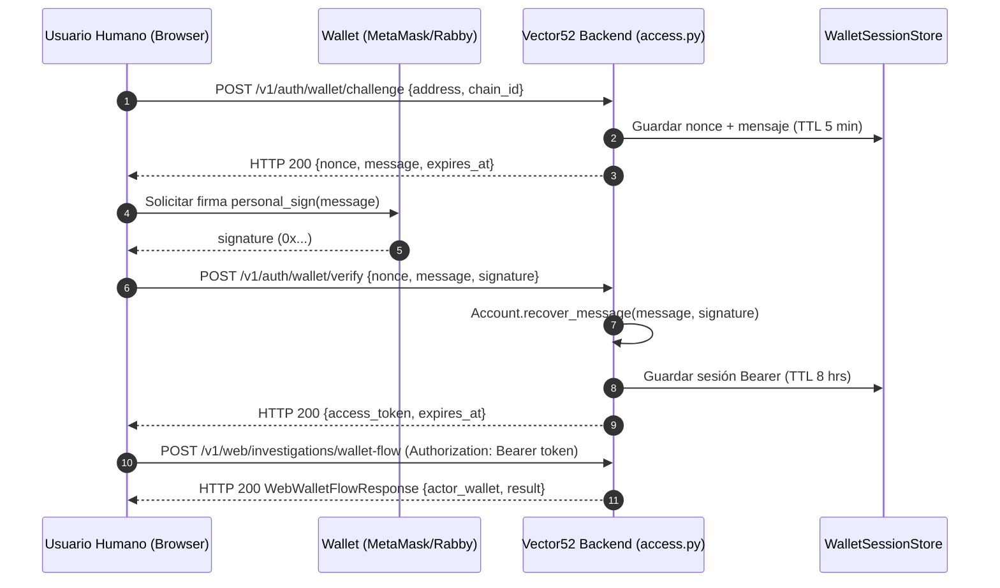
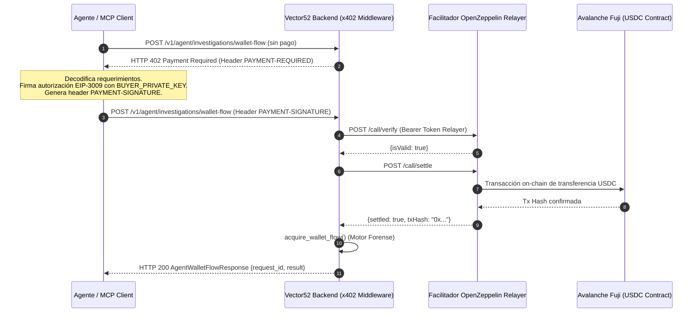
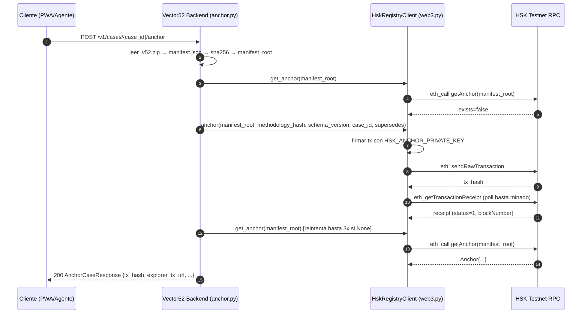

# Vector52 Backend — Documentación Detallada de Arquitectura y Funcionamiento

> **Versión del Sistema:** 0.1.0  
> **Área:** Backend / Evidence Engine  
> **Lema Técnico:** *"Don't just trace the money. Prove the claim."*  
> **Estado:** P0 Implementado y Verificado (72 pruebas superadas)  

---

## Tabla de Contenidos

1. [Introducción y Filosofía del Sistema](#1-introducción-y-filosofía-del-sistema)
2. [Estructura del Proyecto y Módulos](#2-estructura-del-proyecto-y-módulos)
3. [Jerarquía y Taxonomía de Evidencia (L0 a L5)](#3-jerarquía-y-taxonomía-de-evidencia-l0-a-l5)
4. [Motor de Evidencia (Evidence Engine)](#4-motor-de-evidencia-evidence-engine)
   - 4.1 [Preservación e Inmutabilidad (`preservation.py`)](#41-preservación-e-inmutabilidad-preservationpy)
   - 4.2 [Procedencia e Identificadores (`provenance.py`)](#42-procedencia-e-identificadores-provenancepy)
   - 4.3 [Orquestación de Adquisición (`acquisition.py`)](#43-orquestación-de-adquisición-acquisitionpy)
5. [Decodificación Determinista L2: Transferencias ERC-20 (`erc20.py` y `transfer.py`)](#5-decodificación-determinista-l2-transferencias-erc-20-erc20py-y-transferpy)
   - 5.1 [Modelos de Transferencia (`DecodedTransfer` y `TokenMetadata`)](#51-modelos-de-transferencia-decodedtransfer-y-tokenmetadata)
   - 5.2 [Decodificación Estricta y Seguridad de Tipos de 256 bits](#52-decodificación-estricta-y-seguridad-de-tipos-de-256-bits)
   - 5.3 [Aritmética Exacta sin Punto Flotante (`format_token_amount`)](#53-aritmética-exacta-sin-punto-flotante-format_token_amount)
6. [Cámara de Evidencia (Evidence Vault) y Persistencia](#6-cámara-de-evidencia-evidence-vault-y-persistencia)
   - 6.1 [Bóveda de Evidencia en Disco (`EvidenceVault`)](#61-bóveda-de-evidencia-en-disco-evidencevault)
   - 6.2 [Repositorio de Casos (`CaseRepository` y `FileCaseRepository`)](#62-repositorio-de-casos-caserepository-y-filecaserepository)
7. [Capa de Proveedores Externos (Providers)](#7-capa-de-proveedores-externos-providers)
   - 7.1 [BaseProvider y Sanitización de Secretos (`redact`)](#71-baseprovider-y-sanitización-de-secretos-redact)
   - 7.2 [Ethereum RPC Provider (L0)](#72-ethereum-rpc-provider-l0)
   - 7.3 [The Graph Provider (L1) e Interpolación de `{api_key}`](#73-the-graph-provider-l1-e-interpolación-de-api_key)
8. [El Pipeline de Auditoría de 7 Etapas (`AuditPipeline`)](#8-el-pipeline-de-auditoría-de-7-etapas-auditpipeline)
9. [Empaquetado Criptográfico e Integridad (.v52.zip y Manifest)](#9-empaquetado-criptográfico-e-integridad-v52zip-y-manifest)
10. [Configuración y Seguridad](#10-configuración-y-seguridad)
11. [Puntos de Extensión y Contratos de Integración](#11-puntos-de-extensión-y-contratos-de-integración)
12. [Estrategia de Pruebas y Fixtures Verificados](#12-estrategia-de-pruebas-y-fixtures-verificados)
13. [Modelo de Acceso Dual: Humanos (SIWE) vs Agentes Artificiales (x402)](#13-modelo-de-acceso-dual-humanos-siwe-vs-agentes-artificiales-x402)
   - 13.1 [Arquitectura de Canales (WEB vs AGENT_X402)](#131-arquitectura-de-canales-web-vs-agent_x402)
   - 13.2 [Canal Humano: Sign-In with Ethereum (SIWE) y Sesiones en Memoria](#132-canal-humano-sign-in-with-ethereum-siwe-y-sesiones-en-memoria)
   - 13.3 [Canal Artificial: Micropagos x402 M2M y Liquidación en Avalanche](#133-canal-artificial-micropagos-x402-m2m-y-liquidación-en-avalanche)
   - 13.4 [Diagramas de Secuencia e Interacción Criptográfica](#134-diagramas-de-secuencia-e-interacción-criptográfica)
   - 13.5 [Matriz de Protección y Políticas de Cobro](#135-matriz-de-protección-y-políticas-de-cobro)
14. [Anclaje HSK](#14-anclaje-hsk-apponchain-appapianchorpy)
   - 14.1 [Qué se ancla y cómo se calcula](#141-qué-se-ancla-y-cómo-se-calcula)
   - 14.2 [Cliente `HskRegistryClient`](#142-cliente-hskregistryclient-apponchainhsk_registrypy)
   - 14.3 [Idempotencia y tolerancia a lag de lectura](#143-idempotencia-y-tolerancia-a-lag-de-lectura)
   - 14.4 [Diagrama de secuencia](#144-diagrama-de-secuencia)
   - 14.5 [Configuración](#145-configuración)

---

## 1. Introducción y Filosofía del Sistema

Vector52 es un sistema de auditoría y verificación de afirmaciones en Ethereum diseñado bajo el paradigma **"Evidence-First"** (la evidencia primero). A diferencia de los exploradores de bloques o indexadores tradicionales que se enfocan en resumir o interpretar transacciones, Vector52 establece como principio rector que:

1. **La afirmación debe ser probada con evidencia inmutable:** Ningún resultado o veredicto se presenta como válido sin estar respaldado por registros primarios de la cadena o subgrafos indexados verificables.
2. **Hash antes de transformar:** Toda respuesta cruda recibida de nodos Ethereum o The Graph es serializada a su representación canónica JSON y hasheada criptográficamente con SHA-256 antes de someterla a cualquier lógica de decodificación o análisis de negocio.
3. **No invención ante la incertidumbre:** Si un proveedor sufre degradación, timeout, o un subgrafo reporta errores de indexación (`hasIndexingErrors: true`), el sistema degrada explícitamente el estatus del caso a `DEGRADED`, `WARNING` o `PARTIAL`. Jamás se devuelve un estatus `COMPLETE` artificial ni se asumen valores faltantes.
4. **Separación estricta de autoridad:** Los datos directos de la máquina virtual Ethereum (L0) son la fuente de verdad máxima. Las explicaciones generadas por Inteligencia Artificial (L5) son estrictamente complementarias y explicativas; la IA **nunca** dicta un veredicto.
5. **Cero fugas de credenciales:** Ningún secreto, API Key o token Bearer debe ser registrado en logs, incluido en errores devueltos por la API, ni empaquetado dentro de los archivos de distribución `.v52.zip`.
6. **Aritmética entera exacta:** Los números de tokens en Ethereum son enteros sin signo de 256 bits (`uint256`). En ningún caso se transforman a números de punto flotante de 64 bits (IEEE 754) para evitar pérdida de precisión en transacciones financieras de alto volumen.

---

## 2. Estructura del Proyecto y Módulos

El backend se ubica en el directorio `backend/` y posee la siguiente estructura física y lógica:

```
backend/
├── .env.example              # Plantilla de variables de entorno (con endpoints The Graph y placeholders)
├── .gitignore                # Reglas estrictas para ignorar .env, .venv, caches y vault
├── pyproject.toml            # Dependencias del proyecto, metadatos y configuración de pytest
├── ruff.toml                 # Reglas estrictas de linteo y formateo PEP 8 con Ruff
├── README.md                 # Guía de inicio rápido y manual de ejecución multiplataforma
├── docs/                     # Documentación exhaustiva técnica y de API
│   ├── README.md             # Índice y mapa de navegación de la documentación
│   ├── FUNCIONAMIENTO.md     # Arquitectura interna detallada (este documento)
│   └── API.md                # Referencia completa de endpoints, esquemas y códigos
├── app/
│   ├── __init__.py           # Versión del paquete (0.1.0)
│   ├── main.py               # Punto de entrada FastAPI, ciclo de vida, CORS y excepciones
│   ├── config.py             # Configuración Pydantic Settings con safe_repr()
│   ├── api/                  # Capa de controladores HTTP REST
│   │   ├── health.py         # GET /healthz (liveness probe)
│   │   ├── providers.py       # GET /v1/providers/status (estado de RPC/Graph) — FRANCO
│   │   ├── rpc.py            # GET /v1/rpc/{transactions,receipts}/{chain}/{tx_hash} — FRANCO
│   │   ├── audits.py         # POST /v1/audits, GET /v1/audits/{job_id} — FRANCO
│   │   ├── claim_audit.py    # POST /v1/claim-audit (inicia auditoría completa)
│   │   ├── cases.py          # GET /v1/cases/{id}, /evidence, /package
│   │   ├── verify.py         # POST /v1/verify (audita paquetes .v52.zip)
│   │   ├── access.py         # Autenticación con billetera
│   │   ├── agent.py          # Rutas del agente
│   │   ├── anchor.py         # POST /v1/cases/{id}/anchor, GET /v1/anchors/{root} — HSK
│   │   └── wallet_flow.py    # Funciones de flujo de billetera (sin router)
│   ├── claims/               # Módulos de compilación y auditoría de reclamos
│   │   ├── compiler.py       # Descompone el reclamo en predicados formales
│   │   ├── predicates.py     # Evaluación lógica de predicados contra evidencia
│   │   └── auditor.py        # Algoritmo de veredicto final (SUPPORTED, REFUTED, etc.)
│   ├── contribution/         # Análisis de atribución de fondos
│   │   └── direct_flow.py    # Distingue volumen del protocolo vs aporte del sujeto
│   ├── evidence/             # Motor de evidencia (Core)
│   │   ├── acquisition.py    # Orquesta la adquisición paralela de L0 y L1
│   │   ├── preservation.py   # Serialización canónica JSON y hashing SHA-256
│   │   └── provenance.py     # Generadores deterministas de IDs y marcas de tiempo
│   ├── models/               # Esquemas Pydantic V2 y tipos de datos
│   │   ├── claim.py          # ClaimAuditRequest, ClaimAuditResponse, CaseRecord
│   │   ├── evidence.py       # EvidenceRecord, AuthorityLevel, EvidenceStatus
│   │   ├── protocol.py       # ProtocolAction, SwapEvent, TokenInfo
│   │   ├── transfer.py       # DecodedTransfer, TokenMetadata (Transferencias ERC-20 deterministas)
│   │   ├── verdict.py        # Verdict Enum (5 estados posibles)
│   │   ├── access.py         # Modelos de autenticación
│   │   ├── anchor.py         # AnchorCaseRequest/Response, AnchorLookupResponse
│   │   └── wallet_flow.py    # WalletFlowResponse, WalletFlowLimits
│   ├── onchain/               # Cliente HSK V52EvidenceRegistry (Saúl)
│   │   ├── hsk_registry.py    # web3.py: anchorCase(), getAnchor(), logs de CaseAnchored
│   │   └── abi/V52EvidenceRegistry.json # ABI vendorizado desde v52-onchain
│   ├── orchestration/        # Orquestación de pipelines
│   │   └── audit_pipeline.py # Pipeline secuencial de 7 etapas con medición de tiempos
│   ├── packaging/            # Generación de paquetes forenses
│   │   ├── manifest.py       # Construcción de manifest.json y cálculo de hashes
│   │   └── packager.py       # Empaquetado comprimido .v52.zip con exclusión de secretos
│   ├── protocols/            # Decodificación específica de protocolos DeFi
│   │   ├── erc20.py          # Decodificador estricto y determinista de eventos Transfer ERC-20
│   │   └── uniswap_v3.py     # Decodificador de eventos Swap y rutas Uniswap V3
│   ├── providers/            # Adaptadores de comunicación externa
│   │   ├── base.py           # BaseProvider abstracto y función de saneamiento redact()
│   │   ├── ethereum_rpc.py   # Cliente JSON-RPC (eth_getTransactionByHash, etc.)
│   │   ├── the_graph.py      # Cliente GraphQL con extracción de _meta e interpolación {api_key}
│   │   └── alchemy_transfers.py # Cliente Alchemy Transfers API (flujos de billetera)
│   ├── payments/             # Procesamiento de pagos
│   │   └── x402.py           # Configuración de canal x402 (HTTP 402 Payment Required)
│   ├── security/             # Seguridad y gestión de sesiones
│   │   └── wallet_sessions.py # Gestión de sesiones de billetera autenticadas
│   └── storage/              # Capa de almacenamiento y persistencia
│       ├── case_repository.py# Interfaz CaseRepository y adaptador FileCaseRepository
│       ├── evidence_vault.py # Bóveda de almacenamiento append-only con SHA-256 sidecars
│       └── anchor_store.py   # Caché local del último tx_hash de anclaje por caso
├── fixtures/                 # Casos reales verificados de Ethereum Mainnet
│   └── known_case/           # Caso de prueba canónico documentado
│       ├── CASE_NOTES.md     # Notas del caso, hash tx, remitente y análisis
│       ├── ethereum_rpc.json # Respuesta RPC cruda completa (L0)
│       ├── the_graph.json    # Respuesta The Graph completa (L1)
│       ├── token_metadata.json# Metadatos verificados de USDC y WETH
│       └── expected_result.json# Resultado esperado tras decodificación
└── tests/                    # Suite de pruebas unitarias y de integración (91 tests passing, 4 skipped)
    ├── conftest.py           # Fixtures de FastAPI TestClient y carga de .env para pruebas en vivo
    ├── test_claim_audit.py   # Pruebas del endpoint /v1/claim-audit y pipeline
    ├── test_config.py        # Pruebas de configuración (ALCHEMY_API_KEY, RPC, CORS)
    ├── test_erc20_decoder.py # Pruebas del decodificador ERC-20 con fixtures reales
    ├── test_evidence_vault.py# Pruebas de inmutabilidad y sidecars del vault
    ├── test_health.py        # Pruebas del endpoint /healthz
    ├── test_providers.py     # Pruebas en vivo de Ethereum RPC y The Graph (sin mocks)
    ├── test_reconciliation.py# Pruebas de reconciliación Graph ↔ RPC
    ├── test_rpc_api.py       # Pruebas de endpoints RPC y audits — FRANCO
    ├── test_access_channels.py # Pruebas de autenticación con billetera
    └── test_wallet_flow.py   # Pruebas de flujo de billetera y wallet sessions
```

---

## 3. Jerarquía y Taxonomía de Evidencia (L0 a L5)

El sistema clasifica toda la información utilizada en una auditoría según niveles de autoridad estrictos (`AuthorityLevel`), donde un nivel inferior prevalece sobre uno superior en caso de contradicción:

```
  ┌──────────────────────────────────────────────────────────────────┐
  │  L0: CHAIN_PRIMARY                                               │
  │  Nodos RPC Ethereum: Transacción, Recibo, Bloque, Logs crudos    │
  └───────────────────────────────┬──────────────────────────────────┘
                                  │
  ┌───────────────────────────────▼──────────────────────────────────┐
  │  L1: INDEXED                                                     │
  │  The Graph Subgraphs: Entidades indexadas, métricas y _meta      │
  └───────────────────────────────┬──────────────────────────────────┘
                                  │
  ┌───────────────────────────────▼──────────────────────────────────┐
  │  L2: DECODED                                                     │
  │  Eventos decodificados con ABI oficial (Transfer ERC-20, Swaps)  │
  └───────────────────────────────┬──────────────────────────────────┘
                                  │
  ┌───────────────────────────────▼──────────────────────────────────┐
  │  L3: DERIVED                                                     │
  │  Análisis de contribución directa y flujos de fondos netos       │
  └───────────────────────────────┬──────────────────────────────────┘
                                  │
  ┌───────────────────────────────▼──────────────────────────────────┐
  │  L4: ANALYST                                                     │
  │  Predicados evaluados y Veredicto Determinista formal            │
  └───────────────────────────────┬──────────────────────────────────┘
                                  │
  ┌───────────────────────────────▼──────────────────────────────────┐
  │  L5: AI_EXPLANATION (No Autoritativo)                            │
  │  Resumen en lenguaje natural generado por IA para humanos       │
  └──────────────────────────────────────────────────────────────────┘
```

### Detalle de Niveles:

| Nivel | Identificador | Fuente de Datos | Carácter | Rol en el Sistema |
| :--- | :--- | :--- | :--- | :--- |
| **L0** | `L0_CHAIN_PRIMARY` | Ethereum JSON-RPC directo (`eth_getTransactionByHash`, `eth_getTransactionReceipt`, `eth_getBlockByNumber`, `eth_getLogs`). | Primario Absoluto | Máxima autoridad. Provee la prueba matemática de que la tx fue ejecutada, gas consumido, estado binario y eventos emitidos en la EVM. |
| **L1** | `L1_INDEXED` | Subgrafos de The Graph (`query` a la red descentralizada de subgrafos). | Secundario Indexado | Aporta contexto relacional e indexación histórica. Requiere verificación obligatoria de `_meta` (`hasIndexingErrors: false`). |
| **L2** | `L2_DECODED` | Decodificación determinista de logs de L0 usando ABIs reconocidos (ej. `erc20.py` para `Transfer` y Uniswap V3 Pool `Swap`). | Interpretación Local | Transforma datos hexadecimales de topics y data en estructuras verificadas (`DecodedTransfer`, `SwapEvent`) preservando el linaje de L0. |
| **L3** | `L3_DERIVED` | Algoritmos de cálculo de balance y flujo neto (`DirectFlowAnalysis`). | Deducción Local | Resuelve la premisa crítica: **Volumen de Protocolo ≠ Contribución del Sujeto**. Identifica si los tokens provinieron del sujeto o de contratos intermediarios. |
| **L4** | `L4_ANALYST` | Motor lógico de predicados (`app/claims/`). | Decisión Formal | Compara cada afirmación descompuesta contra los datos L0-L3 para emitir el veredicto formal (`SUPPORTED`, `REFUTED`, etc.). |
| **L5** | `L5_AI_EXPLANATION` | Modelos de Lenguaje (LLM / Claude / GPT / Gemini). | No Autoritativo | Puramente explicativo. **No tiene potestad de cambiar el veredicto ni los predicados.** Traduce la prueba formal a explicaciones ejecutivas. |

---

## 4. Motor de Evidencia (Evidence Engine)

El motor de evidencia (`app/evidence/`) garantiza la integridad criptográfica de extremo a extremo mediante tres componentes:

### 4.1 Preservación e Inmutabilidad (`preservation.py`)

La preservación asegura que cualquier objeto Python pueda serializarse en un formato de bytes unívoco e idéntico en cualquier plataforma antes de ser hasheado o almacenado:

1. **Serialización Canónica (`canonicalize`):**
   - Ordena alfabéticamente todas las claves de los diccionarios (`sort_keys=True`).
   - Elimina espacios en blanco superfluos (`separators=(",", ":")`).
   - Aplica codificación UTF-8 sin secuencias de escape no deseadas (`ensure_ascii=False`).
   - Resuelve tipos complejos: objetos `datetime` se convierten a cadenas estándar ISO 8601; objetos de bytes se serializan como cadenas hexadecimales.
2. **Hashing Criptográfico (`sha256_of` y `sha256_of_canonical`):**
   - Calcula el resumen SHA-256 en minúsculas.
   - Cualquier variación, por minúscula que sea, en el cuerpo recibido de la red alterará el hash y será detectada en las verificaciones.

### 4.2 Procedencia e Identificadores (`provenance.py`)

Garantiza la trazabilidad y la reproducibilidad mediante identificadores con prefijos semánticos:

- **`make_case_id(chain_id, tx_hash, subject)`**:
  - Estructura: `case_<chain_id>_<tx_prefix_8>_<subject_prefix_6>_<uuid4_8>`
  - Ejemplo: `case_1_4a8b12f0_d8da6b_9f2a1b3c`
  - Permite a los desarrolladores y al frontend reconocer de inmediato la transacción y el sujeto antes de inspeccionar el contenido completo.
- **`make_evidence_id(source, method, request_payload)`**:
  - Estructura: `ev_<source_clean>_<req_sha256_8>_<uuid4_8>`
  - Ejemplo: `ev_ethereumrpc_b4c810ae_f12c8a41`
  - Se genera usando la huella del **request** (lo que se solicitó), de modo que el ID es predecible y computable antes de recibir la respuesta.
- **`make_request_fingerprint(request_payload)`**:
  - Devuelve una cadena con el formato `sha256:<digest>` sobre el payload canónico de la petición.

### 4.3 Orquestación de Adquisición (`acquisition.py`)

La clase `EvidenceAcquisition` centraliza la recolección de pruebas crudas sin que los módulos de protocolo interactúen directamente con los proveedores:

- **Adquisición L0 (`acquire_l0`):**
  - Ejecuta la llamada al nodo RPC para obtener la transacción, el recibo, el bloque y los logs.
  - Guarda inmediatamente el payload crudo en el `EvidenceVault`.
  - Construye el `EvidenceRecord` correspondiente con su hash SHA-256, path relativo y estatus.
  - Si el recibo no está disponible (la transacción aún no ha sido minada), clasifica el estatus como `DEGRADED` o `UNKNOWN` y emite una advertencia formal.
- **Adquisición L1 (`acquire_l1`):**
  - Ejecuta la consulta GraphQL parametrizada sobre el subgrafo de Uniswap V3.
  - La consulta captura de forma alineada al esquema v3:
    ```graphql
    query UniswapV3Swaps($txHash: String!) {
      _meta {
        block { number hash }
        deployment
        hasIndexingErrors
      }
      swaps(where: { transaction: $txHash }) {
        id
        timestamp
        transaction { id blockNumber }
        pool { id token0 { id symbol decimals } token1 { id symbol decimals } liquidity }
        sender
        recipient
        origin
        amount0
        amount1
        amountUSD
        sqrtPriceX96
        tick
        logIndex
      }
    }
    ```
  - Captura obligatoriamente la cabecera `_meta`, verificando el bloque indexado y si el subgrafo reporta `hasIndexingErrors`.
  - Si el subgrafo reporta errores de indexación, el registro se marca con `status=WARNING`, advirtiendo al pipeline que los datos indexados pueden estar desactualizados.

---

## 5. Decodificación Determinista L2: Transferencias ERC-20 (`erc20.py` y `transfer.py`)

A nivel L2, la información contenida en los logs crudos de la máquina virtual se interpreta conforme a los estándares ABI oficiales.

### 5.1 Modelos de Transferencia (`DecodedTransfer` y `TokenMetadata`)

Definidos en `app/models/transfer.py`:
- **`TokenMetadata`:** Metadatos opcionales de contrato ERC-20 (`address`, `symbol`, `decimals`). Valida que la dirección sea un valor hexadecimal de 20 bytes con prefijo `0x` y la normaliza a minúsculas.
- **`DecodedTransfer`:** Representa un evento `Transfer` decodificado con exactitud a partir de un log L0 específico:
  - `token_address`: Dirección del contrato ERC-20 emisor.
  - `from_address`: Dirección de origen (indexada).
  - `to_address`: Dirección de destino (indexada).
  - `amount_raw`: Monto exacto de la transferencia como cadena decimal entera (`uint256`).
  - `transaction_hash`, `block_number`, `log_index`: Coordenadas de ejecución en la EVM.
  - `evidence_ids`: Lista de identificadores de evidencia L0 de los cuales se derivó el registro (trazabilidad y linaje obligatorio).
  - `token_symbol`, `token_decimals`: Metadatos del token cuando están disponibles.
  - `amount_formatted`: Representación decimal formateada calculada con aritmética exacta.
  - `warnings`: Advertencias acumuladas durante la decodificación.

### 5.2 Decodificación Estricta y Seguridad de Tipos de 256 bits

Implementada en `app/protocols/erc20.py`:
- **Identificador de Tópico Canónico:**
  ```python
  ERC20_TRANSFER_TOPIC = "0xddf252ad1be2c89b69c2b068fc378daa952ba7f163c4a11628f55a4df523b3ef"
  ```
- **Validaciones Rigurosas del Log:**
  1. Debe tener exactamente 3 tópicos (`topics`): tópico 0 (firma `Transfer`), tópico 1 (`from`), tópico 2 (`to`).
  2. Los tópicos 1 y 2 deben ser palabras de 32 bytes con **exactamente 24 ceros de relleno (padding)** a la izquierda. Si contienen padding no-cero, se rechazan inmediatamente con `ERC20DecodeError`.
  3. El campo `data` debe contener exactamente una palabra ABI de 32 bytes (64 caracteres hexadecimales) que codifica el valor `uint256`.
- **Aislamiento de Proveedores:** El decodificador **nunca** realiza llamadas de red ni consulta RPCs; opera exclusivamente sobre los diccionarios de logs crudos preservados en L0.
- **Filtrado y Ordenación:** `decode_transfer_logs()` ignora eventos que no coincidan con la firma de Transferencia ERC-20 y devuelve la lista de transferencias ordenadas ascendentemente por `log_index`.

### 5.3 Aritmética Exacta sin Punto Flotante (`format_token_amount`)

Los enteros `uint256` en Ethereum pueden alcanzar valores de hasta $2^{256}-1$ ($\approx 1.15 \times 10^{77}$). El estándar binario IEEE 754 de 64 bits (`float` en Python y `number` en JavaScript) solo garantiza 53 bits de precisión ($\approx 9 \times 10^{15}$), lo que produciría pérdidas catastróficas de redondeo.

Para resolver esto, `format_token_amount(amount_raw: int, decimals: int) -> str` opera exclusivamente con manipulación de cadenas y aritmética entera:

```python
def format_token_amount(amount_raw: int, decimals: int) -> str:
    """Format a uint exactly with integer/string operations, never binary float."""
    if amount_raw < 0:
        raise ValueError("amount_raw cannot be negative")
    if not 0 <= decimals <= 255:
        raise ValueError("decimals must be between 0 and 255")
    if decimals == 0:
        return str(amount_raw)

    digits = str(amount_raw).rjust(decimals + 1, "0")
    whole = digits[:-decimals]
    fraction = digits[-decimals:].rstrip("0")
    return whole if not fraction else f"{whole}.{fraction}"
```

Si los metadatos de decimales no están disponibles para un token, el decodificador preserva `amount_raw`, omite `amount_formatted` y emite una advertencia estructurada:  
`"Token decimals unavailable for <address>; amount_raw was preserved and amount_formatted was omitted."`

---

## 6. Cámara de Evidencia (Evidence Vault) y Persistencia

### 6.1 Bóveda de Evidencia en Disco (`EvidenceVault`)

El `EvidenceVault` (`app/storage/evidence_vault.py`) es un repositorio de solo anexado (**append-only**).

#### Estructura física en disco:
```
evidence_vault/
├── raw/
│   └── <case_id>/
│       ├── <evidence_id>.json       ← JSON canónico del payload recibido
│       └── <evidence_id>.sha256     ← Hash SHA-256 en texto plano (sidecar)
├── cases/
│   └── <case_id>/
│       └── case.json                ← Estado y metadatos del caso
└── packages/
    └── <case_id>.v52.zip            ← Archivo forense final descargable
```

#### Reglas de Inmutabilidad del Vault:
1. **Prohibición de Sobreescritura:** Si se intenta preservar evidencia con un `evidence_id` que ya existe en el caso, `preserve_raw()` lanza inmediatamente un `EvidenceVaultError`. La evidencia nunca se muta.
2. **Archivos Sidecar (.sha256):** Cada payload guardado va acompañado de un archivo con el mismo nombre y extensión `.sha256`. Esto permite a auditores externos verificar la integridad usando herramientas de terminal estándar (`sha256sum -c`) sin necesidad de ejecutar el backend de Vector52.
3. **Verificación en Caliente (`verify_raw`):** Permite verificar en cualquier momento si un archivo en disco ha sido manipulado o corrompido comparando su lectura física actual contra el hash registrado.

### 6.2 Repositorio de Casos (`CaseRepository` y `FileCaseRepository`)

Define la interfaz abstracta (`CaseRepository`) para almacenar los metadatos de los casos auditados:
- **Fase P0 (Actual):** Implementada mediante `FileCaseRepository`. Cada caso se guarda como un documento JSON en `evidence_vault/cases/<case_id>/case.json`. Esto permite operar el demo de ETHOnline sin requerir dependencias complejas de bases de datos externas.
- **Fase P1 (Preparada en Arquitectura):** La interfaz `CaseRepository` está diseñada para ser sustituida por un adaptador MongoDB (`MongoCaseRepository`) sin modificar ni una sola línea de la lógica de negocio ni de la API.

---

## 7. Capa de Proveedores Externos (Providers)

Los proveedores son clientes HTTP asíncronos (`httpx`) encargados de consultar servicios externos.

### 7.1 BaseProvider y Sanitización de Secretos (`redact`)

Todos los proveedores heredan de `BaseProvider`. Este provee:
- **Gestión de Ciclo de Vida y Estatus:** Mantiene el estado interno del proveedor (`OK`, `DEGRADED`, `TIMEOUT`, `FAILED`, `UNKNOWN`).
- **Sanitización de Cadenas (`redact`):** Emplea expresiones regulares para escanear y ofuscar de manera proactiva tokens Bearer, parámetros `api_key=...`, headers `Authorization` y URLs de RPCs tipo Infura/Alchemy que contengan credenciales en el path.

```python
# app/providers/base.py
def redact(text: str) -> str:
    """Reemplaza patrones conocidos de secretos con [REDACTED]."""
    for pattern in _SECRET_PATTERNS:
        text = pattern.sub(r"\1[REDACTED]", text)
    return text
```

### 7.2 Ethereum RPC Provider (L0)

`EthereumRpcProvider` implementa los métodos estándar de JSON-RPC 2.0 requeridos para reconstruir el estado primario de la EVM:
1. `eth_getTransactionByHash`: Obtiene el remitente (`from`), destinatario (`to`), valor transferido (`value`), gas ofrecido y datos crudos de entrada (`input`).
2. `eth_getTransactionReceipt`: Obtiene el estatus de ejecución (`status: "0x1"` exitoso, `"0x0"` fallido), gas consumido, bloque de inclusión y todos los logs/eventos emitidos.
3. `eth_getBlockByNumber`: Extrae la marca de tiempo precisa del bloque (`timestamp`), hash del bloque y dificultad/base fee.
4. `eth_getLogs`: Permite consultas complementarias con filtros de tópicos y contratos.

**Regla de Oro:** Si el RPC responde con error HTTP, timeout o un mensaje de error JSON-RPC, el proveedor no genera excepciones sin control, sino que mapea el error a `ProviderError` sanitizado y marca el estado del proveedor como `FAILED` o `TIMEOUT`.

### 7.3 The Graph Provider (L1) e Interpolación de `{api_key}`

`TheGraphProvider` ejecuta consultas GraphQL contra subgrafos de The Graph.

- **Interpolación Dinámica de API Key:**  
  Permite configurar endpoints que incluyan la plantilla `{api_key}` (formato oficial de The Graph Studio / Gateway). Si se suministra `api_key`, se inyecta en la URL y se agrega la cabecera `Authorization: Bearer <key>`. Si no se suministra, el marcador se remueve limpiamente:
  ```python
  if "{api_key}" in endpoint:
      if api_key:
          endpoint = endpoint.replace("{api_key}", api_key)
      else:
          endpoint = endpoint.replace("/{api_key}", "").replace("{api_key}", "")
  ```
- **Configuración Canónica de Uniswap V3 en Mainnet:**
  - **Subgraph ID:** `5zvR82QoaXYFyDEKLZ9t6v9adgnptxYpKpSbxtgVENFV`
  - **Deployment IPFS:** `QmTZ8ejXJxRo7vDBS4uwqBeGoxLSWbhaA7oXa1RvxunLy7`
  - **Gateway URL:** `https://gateway.thegraph.com/api/{api_key}/subgraphs/id/5zvR82QoaXYFyDEKLZ9t6v9adgnptxYpKpSbxtgVENFV`
- **Extracción de `_meta`:**
  - `block.number` y `block.hash` para comparar la frescura del subgrafo contra el bloque real obtenido en L0.
  - `deployment` (identificador IPFS del despliegue).
  - `hasIndexingErrors`: Si es `true`, agrega automáticamente una advertencia y marca la evidencia como degradada.

---

## 8. El Pipeline de Auditoría de 7 Etapas (`AuditPipeline`)

El orquestador central (`app/orchestration/audit_pipeline.py`) ejecuta el flujo completo de una auditoría en 7 etapas cronometradas de forma secuencial:

```
                  ┌─────────────────────────────────────┐
                  │    POST /v1/claim-audit (Request)   │
                  └──────────────────┬──────────────────┘
                                     │
                                     ▼
                 ┌───────────────────────────────────────┐
                 │  Etapa 1: Adquisición L0 (RPC)        │
                 │  - eth_getTransaction / Receipt / Logs│
                 │  - Preservación en Vault (.json/.sha) │
                 └───────────────────┬───────────────────┘
                                     │
                                     ▼
                 ┌───────────────────────────────────────┐
                 │  Etapa 2: Adquisición L1 (The Graph)  │
                 │  - GraphQL Swaps + _meta Check        │
                 │  - Preservación en Vault (.json/.sha) │
                 └───────────────────┬───────────────────┘
                                     │
                                     ▼
                 ┌───────────────────────────────────────┐
                 │  Etapa 3: Decodificación Protocolo    │
                 │  - Interpretación Transfer ERC-20     │
                 │  - Interpretación Uniswap V3 Swap     │
                 │  - Identificación Router / Tokens     │
                 └───────────────────┬───────────────────┘
                                     │
                                     ▼
                 ┌───────────────────────────────────────┐
                 │  Etapa 4: Análisis de Contribución    │
                 │  - Volumen Protocolo vs Aporte Sujeto │
                 │  - Detección de intermediarios        │
                 └───────────────────┬───────────────────┘
                                     │
                                     ▼
                 ┌───────────────────────────────────────┐
                 │  Etapa 5: Compilación de Predicados   │
                 │  - Descomposición formal del Reclamo  │
                 │  - Evaluación booleana de predicados  │
                 └───────────────────┬───────────────────┘
                                     │
                                     ▼
                 ┌───────────────────────────────────────┐
                 │  Etapa 6: Veredicto Determinista      │
                 │  - Emisión de Veredicto (SUPPORTED...)│
                 │  - Determinación de Gaps y Advertencia│
                 └───────────────────┬───────────────────┘
                                     │
                                     ▼
                 ┌───────────────────────────────────────┐
                 │  Etapa 7: Empaquetado Forense         │
                 │  - Construcción de manifest.json      │
                 │  - Generación de <case_id>.v52.zip    │
                 └───────────────────┬───────────────────┘
                                     │
                                     ▼
                  ┌─────────────────────────────────────┐
                  │ ClaimAuditResponse (JSON Completo)  │
                  └─────────────────────────────────────┘
```

### Determinación del Estado del Caso (`CaseStatus`):
Al finalizar la recolección, el estado se calcula mediante reglas no ambiguas:
- **`FAILED`:** Si todos los proveedores fallan y no existe evidencia utilizable.
- **`DEGRADED`:** Si algún proveedor falla, arroja respuestas parciales o el subgrafo tiene errores de indexación.
- **`COMPLETE`:** Únicamente si todos los proveedores respondieron con éxito total y no hay errores de indexación.

---

## 9. Empaquetado Criptográfico e Integridad (.v52.zip y Manifest)

Para garantizar la transportabilidad de una auditoría, el sistema empaqueta el caso en un contenedor comprimido `.v52.zip`.

### Estructura Interna del Archivo `.v52.zip`:
```
<case_id>.v52.zip
├── manifest.json              # Raíz de confianza con metadatos y hashes
└── raw/
    └── <case_id>/
        ├── ev_ethereumrpc_...json
        ├── ev_ethereumrpc_...sha256
        ├── ev_thegraph_...json
        └── ev_thegraph_...sha256
```

### Estructura de `manifest.json`:
El archivo `manifest.json` actúa como la lista de empaque verificable:
```json
{
  "schema_version": "0.1.0",
  "adapter_version": "0.1.0",
  "generated_at": "2026-09-09T04:15:30.123456+00:00",
  "case_id": "case_1_4a8b12f0_d8da6b_9f2a1b3c",
  "scope": {
    "chain_id": 1,
    "transaction_hash": "0x4a8b12f0...",
    "subject": "0xd8da6bf26964af9d7eed9e03e53415d37aa96045",
    "claim": "Subject swapped 10 ETH for DAI on Uniswap V3"
  },
  "status": "COMPLETE",
  "verdict": "SUPPORTED",
  "warnings": [],
  "files": {
    "raw/case_1_4a8b.../ev_ethereumrpc_....json": "e3b0c44298fc1c149afbf4c8996fb92427ae41e4649b934ca495991b7852b855",
    "raw/case_1_4a8b.../ev_ethereumrpc_....sha256": "ca978112ca1bbdcafac231b39a23dc4da786eff8147c4e72b9807785afee48bb"
  }
}
```

### Proceso de Verificación Criptográfica (`POST /v1/verify`):
Cualquier parte interesada (el frontend, un auditor independiente o un validador) puede enviar un archivo `.v52.zip` al endpoint `/v1/verify`. El verificado realiza tres inspecciones críticas:
1. **Integridad de Archivos Declarados:** Descomprime en memoria cada archivo listado en `manifest.json`, calcula su hash SHA-256 en caliente y comprueba que coincida exactamente con el declarado.
2. **Detección de Archivos Faltantes:** Si un archivo está listado en `manifest.json` pero no existe dentro del archivo ZIP, la verificación falla (`Declared file is missing from ZIP`).
3. **Detección de Manipulación / Archivos Espurios (Tamper Detection):** Si el archivo ZIP contiene archivos adicionales que **no** fueron declarados en `manifest.json`, la verificación falla inmediatamente (`File present in ZIP but not declared in manifest`). Esto evita que un atacante inyecte archivos maliciosos o evidencias falsas en el contenedor.

---

## 10. Configuración y Seguridad

### Variables de Entorno (`app/config.py`):
Toda la configuración se gestiona mediante Pydantic Settings y se documenta en `.env.example`:

| Variable | Tipo | Valor por Defecto | Obligatoria en Producción | Descripción |
| :--- | :--- | :--- | :--- | :--- |
| `V52_ENV` | `str` | `development` | Sí | Entorno de ejecución (`development`, `production`). |
| `V52_CORS_ORIGINS` | `str` | `""` | No | Lista separada por comas de orígenes CORS permitidos en producción. |
| `V52_PUBLIC_ORIGIN` | `str` | `http://localhost:5173` | No | Origen público del frontend para redirecciones e integración. |
| **RPC Configuration (Alchemy)** |
| `ALCHEMY_API_KEY` | `str` | `""` | Sí (recomendado) | Clave única de Alchemy para construir automáticamente URLs de Ethereum y Avalanche. |
| `ALCHEMY_ETH_RPC_URL` | `str` | `""` | Sí (alternativa) | URL completa del endpoint Ethereum JSON-RPC de Alchemy (sobrescribe `ALCHEMY_API_KEY`). |
| `ALCHEMY_AVAX_RPC_URL` | `str` | `""` | No | URL del endpoint Avalanche C-Chain (sobrescribe construcción desde `ALCHEMY_API_KEY`). |
| `ALCHEMY_ETH_CHAIN_ID` | `int` | `1` | No | Chain ID esperado para Ethereum (validación). |
| `ALCHEMY_AVAX_CHAIN_ID` | `int` | `43114` | No | Chain ID para Avalanche (43114 = Mainnet, 43113 = Fuji Testnet). |
| `HSK_RPC_URL` | `str` | `""` | No | Endpoint RPC independiente para HSK (no disponible en Alchemy). |
| `HSK_CHAIN_ID` | `int` | `177` | No | Chain ID para HSK (validación). |
| `RPC_TIMEOUT_MS` | `int` | `12000` | No | Timeout en milisegundos para llamadas RPC. |
| `RPC_MAX_RETRIES` | `int` | `2` | No | Número máximo de reintentos en caso de fallo transitorio. |
| **The Graph Configuration** |
| `V52_GRAPH_ENDPOINT` | `str` | `https://gateway.thegraph.com/api/{api_key}/subgraphs/id/5zvR82QoaXYFyDEKLZ9t6v9adgnptxYpKpSbxtgVENFV` | Sí | URL del subgrafo de The Graph para Uniswap V3 con soporte de `{api_key}`. |
| `V52_GRAPH_API_KEY` | `str` | `""` | No | API Key de The Graph Studio interpolada en la URL. |
| **Storage & Vault** |
| `V52_DATA_DIR` | `str` | `./evidence_vault` | No | Ruta del sistema de archivos donde opera el Evidence Vault. |
| `V52_STORAGE_BACKEND`| `str` | `file` | No | Adaptador de almacenamiento (`file`, `mongo`). |
| `V52_MONGODB_URI` | `str` | `""` | No (P1) | URI de conexión para MongoDB (Fase P1). |
| `V52_MONGODB_DATABASE` | `str` | `vector52` | No | Nombre de la base de datos MongoDB. |
| **Caching (Optional)** |
| `V52_CACHE_ENABLED` | `bool` | `False` | No | Habilita caché mediante Upstash Redis. |
| `V52_UPSTASH_REDIS_REST_URL` | `str` | `""` | No | URL REST del servicio Upstash Redis. |
| `V52_UPSTASH_REDIS_REST_TOKEN` | `str` | `""` | No | Token de autenticación para Upstash Redis. |
| `V52_CACHE_TTL_SECONDS` | `int` | `120` | No | Tiempo de vida de elementos en caché (segundos). |
| **AI (Non-Authoritative, L5)** |
| `V52_AI_ENABLED` | `bool`| `False` | No | Bandera para habilitar resúmenes L5 explicativos generados por IA. |
| `V52_AI_API_KEY` | `str` | `""` | No | Clave de API para servicio de IA. |
| **x402 Payment Channel (Optional)** |
| `V52_X402_ENABLED` | `bool` | `False` | No | Habilita canal de pago x402. |
| `V52_X402_FACILITATOR_URL` | `str` | `""` | No | URL del facilitador x402. |
| `V52_X402_FACILITATOR_API_KEY` | `str` | `""` | No | API Key del facilitador x402. |
| `V52_X402_PAY_TO` | `str` | `""` | No | Dirección de pago (recibidor). |
| `V52_X402_NETWORK` | `str` | `eip155:43113` | No | Red EIP-155 para x402 (Avalanche Fuji por defecto). |
| `V52_X402_ASSET` | `str` | `0x5425890298aed601595a70AB815c96711a31Bc65` | No | Dirección de contrato del token de pago x402. |
| `V52_X402_WALLET_FLOW_PRICE` | `str` | `1000` | No | Precio en tokens para el endpoint de wallet flow. |

### Medidas de Seguridad Implementadas:
- **`safe_repr()`:** Al arrancar el servidor en `main.py`, se registran en los logs los valores de configuración mediante `settings.safe_repr()`, el cual reemplaza todas las URLs sensibles, claves API y tokens por la cadena `***REDACTED***`.
- **Manejador Global de Excepciones:** Se captura cualquier excepción no manejada (`Exception`) y se responde con un código HTTP 500 genérico (`{"detail": "An internal error occurred. No secrets were exposed."}`). Los stack traces completos jamás se exponen a clientes externos.
- **Validación de Producción:** Si `V52_ENV=production` y faltan `V52_RPC_URL` o `V52_GRAPH_ENDPOINT`, la aplicación aborta inmediatamente su inicio con un error explicativo.

---

## 11. Puntos de Extensión y Contratos de Integración

El backend provee interfaces desacopladas y stubs limpios que permiten el desarrollo colaborativo en paralelo:

### Módulos asignados a Jhamil (Protocolos y Contribución):
1. **`app/protocols/uniswap_v3.py` (`UniswapV3Resolver`):**
   - Recibe los registros `l0_record`, `l0_raw`, `l1_record`, `l1_raw` y la dirección del sujeto.
   - Debe extraer los eventos `Swap` de los logs de L0 o de la entidad `swaps` de L1, complementándose con los eventos `Transfer` decodificados por `app/protocols/erc20.py`, y poblar el modelo Pydantic `ProtocolAction`.
   - **Contrato:** No debe realizar llamadas HTTP externas. Toda la información debe provenir exclusivamente de la evidencia cruda preservada.
2. **`app/contribution/direct_flow.py` (`DirectFlowAnalysis`):**
   - Resuelve si los fondos transferidos salieron directamente de la billetera del sujeto (`subject`) o a través de contratos proxy / enrutadores (ej. Permit2, Universal Router).
   - Genera el modelo `ContributionSummary`.

### Módulos asignados a Omar (Compilación y Veredicto):
1. **`app/claims/compiler.py` (`compile_claim`):**
   - Analiza la cadena de texto `claim` provista por el usuario y la descompone en una lista de objetos `Predicate` verificables (ej. predicado de remitente, predicado de token, predicado de monto).
2. **`app/claims/predicates.py` (`evaluate_predicates`):**
   - Contrasta los predicados contra los datos de `ProtocolAction` y `ContributionSummary` determinando si cada predicado es `True`, `False` o indeterminado.
3. **`app/claims/auditor.py` (`audit`):**
   - Ejecuta la matriz de decisión que genera el veredicto final:
     - `SUPPORTED`: Todos los predicados clave se cumplieron con evidencia directa.
     - `PARTIALLY_SUPPORTED`: Se comprobó la interacción pero difieren montos o intermediarios.
     - `MISLEADING`: La transacción existió pero el sujeto no tuvo la participación alegada.
     - `REFUTED`: La evidencia contradice formalmente la afirmación.
     - `UNKNOWN`: La evidencia fue insuficiente o los proveedores no respondieron.

---

## 12. Estrategia de Pruebas y Fixtures Verificados

La suite de pruebas automatizadas en `tests/` ejecuta llamadas reales contra Ethereum RPC y The Graph (sin mocks). `tests/conftest.py` carga el `.env` local del backend; las pruebas que requieren `V52_GRAPH_API_KEY` (gateway de The Graph) se omiten automáticamente (`skipif`) cuando la clave no está configurada, y ninguna credencial se hardcodea en el código versionado. `V52_RPC_URL` cae por defecto a un endpoint público (`https://eth.drpc.org`) cuando no se configura uno propio.

### Fixtures Reales de Ethereum Mainnet (`fixtures/known_case/`):
El repositorio incluye un caso de auditoría real completo de Ethereum Mainnet documentado en `CASE_NOTES.md`:
- `ethereum_rpc.json`: Transacción real que involucra un Swap en Uniswap V3 entre USDC y WETH con emisión de logs de `Transfer`.
- `the_graph.json`: Respuesta GraphQL correspondiente indexada por el subgrafo de Uniswap V3 con bloque y `_meta`.
- `token_metadata.json`: Metadatos comprobados de tokens USDC (6 decimales) y WETH (18 decimales).
- `expected_result.json`: Salida de transferencias decodificadas esperada para validar la fidelidad del decodificador.

### Cobertura de la Suite de Pruebas (91 pruebas passing, 4 skipped cuando `V52_GRAPH_API_KEY` no está configurada):
- **`test_erc20_decoder.py`:** Verifica la decodificación cronológica en orden de `logIndex`, manejo de metadatos faltantes, rechazo de topics malformados o padding inválido, preservación exacta de `uint256` máximo ($(2^{256}-1)$) e interpolación exacta de decimales sin flotantes.
- **`test_providers.py`:** Ejecuta llamadas reales al cliente JSON-RPC y a The Graph GraphQL contra Ethereum Mainnet, saneamiento de credenciales con `redact()` e interpolación de `{api_key}` en URLs de subgrafo. Las pruebas del gateway de The Graph se omiten si `V52_GRAPH_API_KEY` no está configurada.
- **`test_evidence_vault.py`:** Integridad append-only del almacenamiento, prohibición de sobreescritura y sidecars `.sha256`.
- **`test_claim_audit.py`:** Pipeline end-to-end de auditoría y validación de endpoints REST.
- **`test_health.py`:** Liveness probe `/healthz` y disponibilidad de esquema OpenAPI.

Para ejecutar la verificación completa:
```bash
# Desde la carpeta backend con el entorno virtual activo:
source .venv/bin/activate

# 1. Comprobación de tipos y linteo estricto
ruff check .

# 2. Ejecución de la suite de pruebas unitarias e integración
pytest -v
```

---

## 13. Modelo de Acceso Dual: Humanos (SIWE) vs Agentes Artificiales (x402)

Vector52 implementa una separación explícita entre usuarios interactivos de navegador y consumidores programáticos autónomos. Ambos canales se desacoplan en la capa de controladores (`app/api/access.py` y `app/api/agent.py`), pero convergen en el mismo núcleo forense determinista (`app/api/wallet_flow.py` y `app/orchestration/audit_pipeline.py`).

### 13.1 Arquitectura de Canales (`WEB` vs `AGENT_X402`)

```
               ┌────────────────────────────────────────────────────────┐
               │                 Clientes de Vector52                   │
               └───────────────────┬────────────────┬───────────────────┘
                                   │                │
            Canal Humano (Browser) │                │ Canal Agente (M2M)
                                   ▼                ▼
                     ┌──────────────────┐     ┌──────────────────┐
                     │ PWA Frontend Web │     │ MCP / IA Agents  │
                     └─────────┬────────┘     └────────┬─────────┘
                               │                       │
               EIP-4361 (SIWE) │                       │ x402 v2 Protocol
             Offchain Signature│                       │ EIP-3009/EIP-712
                               ▼                       ▼
                     ┌──────────────────┐     ┌──────────────────┐
                     │ /v1/auth/wallet/*│     │ PaymentMiddleware│
                     │  Session Store   │     │      (x402)      │
                     └─────────┬────────┘     └────────┬─────────┘
                               │ Bearer                │ Verified &
                               │ Token                 │ Settled
                               ▼                       ▼
                     ┌──────────────────┐     ┌──────────────────┐
                     │ /v1/web/*        │     │ /v1/agent/*      │
                     └─────────┬────────┘     └────────┬─────────┘
                               │                       │
                               └───────────┬───────────┘
                                           │
                                           ▼
                     ┌───────────────────────────────────────────┐
                     │       Motor Forense Unificado Core        │
                     │  - acquire_wallet_flow() (Alchemy L2)     │
                     │  - AuditPipeline (RPC L0 + The Graph L1)  │
                     │  - Evidence Vault & SHA-256 Hashes        │
                     └───────────────────────────────────────────┘
```

---

### 13.2 Canal Humano: Sign-In with Ethereum (SIWE) y Sesiones en Memoria

Para usuarios humanos que interactúan mediante la PWA, requerir un pago on-chain por cada clic o consulta destruiría la experiencia de usuario (UX) debido a la fricción de aprobaciones repetitivas en wallets como MetaMask. 

Por ello, el canal humano emplea **Sign-In with Ethereum (EIP-4361)**:
1. **Desafío Único (`_CHALLENGE_TTL = 5 min`):** `POST /v1/auth/wallet/challenge` genera un nonce aleatorio (`secrets.token_urlsafe(18)`) y un mensaje formal que incluye dominio, URI de origen, chain ID, timestamps y advertencia explícita: *"Authenticate this browser session to Vector52. No blockchain transaction will be sent."*
2. **Firma Off-Chain Gratuita:** El usuario firma mediante `personal_sign`. No requiere gas ni interactúa con la blockchain.
3. **Verificación Criptográfica:** `POST /v1/auth/wallet/verify` valida la firma usando `eth_account.Account.recover_message` y comprueba que coincida estrictamente con el registro original.
4. **Almacenamiento de Sesión (`WalletSessionStore`):** Se genera un token Bearer opaco de 32 bytes (`secrets.token_urlsafe(32)`) con una duración de 8 horas (`_SESSION_TTL = 8h`). Los tokens se almacenan en memoria indexados por su hash SHA-256 (`_token_digest`) para proteger las credenciales en caso de volcado de memoria.

---

### 13.3 Canal Artificial: Micropagos x402 M2M y Liquidación en Avalanche

Los agentes de Inteligencia Artificial (IAs, servidores MCP, bots autónomos) no poseen interacción humana en tiempo real para aprobar ventanas emergentes. Además, pueden ejecutar consultas en bucles de razonamiento masivos que agotarían las cuotas de APIs externas (Alchemy, The Graph) si fueran gratuitas.

El canal de agentes utiliza el protocolo **x402 (HTTP 402 Payment Required)**:
- **Middleware ASGI (`PaymentMiddlewareASGI`):** Intercepta peticiones a `/v1/agent/*`. Si la petición no cuenta con pago, devuelve `HTTP 402` y el header `PAYMENT-REQUIRED` con la cotización exacta.
- **Autorización EIP-3009 / EIP-712:** El cliente MCP firma la autorización con su clave delegada o control de gasto programático (`BUYER_PRIVATE_KEY`).
- **Liquidación Delegada al Facilitador:** El backend Vector52 se comunica con el **OpenZeppelin Relayer** (`/call/verify` y `/call/settle`) autenticado mediante `BearerAuthProvider`.
- **Red de Liquidación:** **Avalanche Fuji Testnet** (`eip155:43113`) utilizando el contrato de **USDC** (`0x5425890298aed601595a70AB815c96711a31Bc65`).
- **Stateless:** No requiere almacenamiento de sesiones; cada petición se verifica y liquida atómicamente por su uso exacto.

---

### 13.4 Diagramas de Secuencia e Interacción Criptográfica

#### Flujo Humano: Autenticación SIWE en PWA


#### Flujo Agente: Micropago Autónomo x402 M2M


---

### 13.5 Matriz de Protección y Políticas de Cobro

Vector52 define cuatro niveles de acceso para balancear usabilidad, sostenibilidad y descentralización:

| Nivel de Protección | Audiencia | Endpoints | Mecanismo de Seguridad |
|---|---|---|---|
| **Nivel 0: Bien Público / Abierto** | Cualquier cliente (Humanos y Agentes) | `GET /healthz`, `GET /v1/providers/status`, `GET /v1/agent/capabilities`, `GET /v1/audits/{job_id}`, `POST /v1/verify` | Totalmente público. Cero tarifas. La verificación de integridad `.v52.zip` se mantiene abierta para auditoría universal. |
| **Nivel 1: Autenticación Web Interactiva** | Usuarios Humanos (PWA) | `POST /v1/auth/wallet/challenge`, `POST /v1/auth/wallet/verify`, `GET /v1/auth/wallet/me`, `POST /v1/web/investigations/wallet-flow`, `POST /v1/audits` | Firma SIWE sin gas. Sesión Bearer de 8 horas. Cuotas interactivas de investigación controladas por rate-limiting. |
| **Nivel 2: Micropago M2M Agentes** | IAs, MCPs, Bots Autónomos | `POST /v1/agent/investigations/wallet-flow` (1000 atomic USDC) | Protocolo x402 v2 con settlement on-chain en Avalanche Fuji. Cobro por consulta para amortizar consumo de API externas. |
| **Nivel 3: Operaciones On-Chain / Premium** | Humanos y Agentes | `POST /v1/paid/claim-audit` (5000 atomic USDC), `POST /v1/cases/{case_id}/anchor` (2000 atomic USDC), `GET /v1/cases/{case_id}/package` (500 atomic USDC) | Requiere pago x402 tanto para agentes como para humanos (modal Web3 en PWA) para cubrir patrocinio de gas en HSK y análisis con IA L5. |

---

## 14. Anclaje HSK (`app/onchain/`, `app/api/anchor.py`)

`V52EvidenceRegistry` (`v52-onchain/contracts/hsk/V52EvidenceRegistry.sol`,
desplegado en HSK Testnet: ver `v52-onchain/deployments/hsk-testnet.json`)
ancla el compromiso criptográfico de un expediente `.v52` sin exponer su
contenido. El backend es el único componente que habla con este contrato.

### 14.1 Qué se ancla y cómo se calcula

```
manifest_root      = sha256(manifest.json exactamente como fue empaquetado en el .v52.zip)
methodology_hash    = sha256(HSK_METHODOLOGY_VERSION)   # ej. "v52-contribution-0.1.0"
schema_version      = manifest.json["schema_version"]
case_id             = case_id del path (no sensible, ya público en el propio caso)
supersedes          = manifest_root anterior, o 0x000...0 si es un primer anclaje
```

`manifest_root` se calcula leyendo `manifest.json` directamente del ZIP ya
construido — nunca se reserializa. Esto garantiza que el hash anclado en
HSK es exactamente el mismo que `POST /v1/verify` recalculará al validar
cualquier copia del paquete, cerrando el circuito
`.v52 → manifest_root → transacción HSK → GET /v1/anchors/{root} → verifier PASS`
descrito en `docs/PROYECTO-FINAL.md` §7.1.

### 14.2 Cliente `HskRegistryClient` (`app/onchain/hsk_registry.py`)

Envoltorio delgado sobre `web3.py`:

- **Lectura** (`get_anchor`, `is_anchored`, `find_anchor_tx_hash`): no
  requiere llave privada. `find_anchor_tx_hash` consulta
  `eth_getLogs` acotado al **bloque exacto** que el propio contrato reportó
  (`Anchor.blockNumber`) — los nodos RPC públicos de HSK Testnet limitan el
  rango de `eth_getLogs` a 100.000 bloques, por lo que escanear desde el
  génesis no es viable en una cadena con historial largo.
- **Escritura** (`anchor`): firma la transacción con
  `HSK_ANCHOR_PRIVATE_KEY` (`eth_account.Account.sign_transaction`), la
  envía con `eth_sendRawTransaction` y espera el recibo con
  `wait_for_transaction_receipt`. Todas las llamadas son síncronas
  (limitación de `web3.py`); los endpoints FastAPI las ejecutan con
  `asyncio.to_thread()` para no bloquear el event loop.
- **Saneamiento de errores:** toda excepción se envuelve en
  `HskRegistryError` y se pasa por `redact()` (el mismo helper que usan los
  providers RPC/Graph) antes de propagarse a la API — nunca se filtra la
  URL del RPC ni la llave privada.

### 14.3 Idempotencia y tolerancia a lag de lectura

`POST /v1/cases/{case_id}/anchor` primero llama a `get_anchor(manifest_root)`.
Si el root ya existe (reintento tras un paquete sin cambios, o una llamada
duplicada), **no se envía una nueva transacción**: se responde con los
datos ya anclados y `already_anchored: true`.

Cuando sí se ancla por primera vez, se observó en HSK Testnet que leer el
registro inmediatamente después de que `wait_for_transaction_receipt`
confirma el minado puede fallar (`get_anchor` devuelve `None`) — el RPC
público parece repartir lecturas entre nodos con leve desfase. El endpoint
reintenta la relectura hasta 3 veces con 2s de espera
(`_get_anchor_with_retry` en `app/api/anchor.py`) antes de responder `502`;
la transacción en sí ya es final en ese punto, así que el reintento es de
lectura pura y no reenvía nada a la cadena.

### 14.4 Diagrama de secuencia



### 14.5 Configuración

Ver `docs/API.md` §3.16 para el contrato HTTP completo y
`README.md` §2 para las variables `HSK_RPC_URL`, `HSK_CHAIN_ID`,
`HSK_EVIDENCE_REGISTRY_ADDRESS`, `HSK_EXPLORER_URL` y
`HSK_ANCHOR_PRIVATE_KEY`. `GET /v1/anchors/{manifest_root}` solo requiere
las dos primeras (lectura pública); `POST /v1/cases/{case_id}/anchor`
requiere además la llave firmante, que debe estar allow-listada como
`issuer` en el contrato (`v52-onchain/SECURITY.md`).

