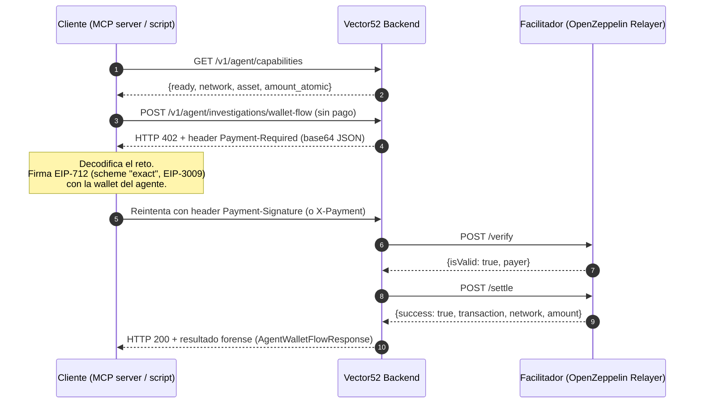

# Guía de Integración x402 — Servidor MCP

> Este manual es la contraparte práctica de [`FUNCIONAMIENTO.md` §13](./FUNCIONAMIENTO.md#13-modelo-de-acceso-dual-humanos-siwe-vs-agentes-artificiales-x402) y [`API.md` §3.13–3.14](./API.md#313-canal-de-agentes-e-ias-con-x402-m2m). Está escrito para quien va a consumir el canal x402 de Vector52 desde un servidor MCP (agente/IA), no para quien mantiene el backend. La integración del frontend PWA está documentada en [`X402_FRONTEND.md`](./X402_FRONTEND.md).

---

## 1. Qué está implementado hoy (y qué no)

| Nivel (ver matriz completa en `API.md` §3.14) | Endpoint | Estado |
|---|---|---|
| Nivel 0 — Público | `GET /v1/agent/capabilities` | ✅ Implementado y verificado |
| Nivel 2 — Micropago M2M | `POST /v1/agent/investigations/wallet-flow` | ✅ Implementado y verificado end-to-end (ver §5) |
| Nivel 3 — On-chain / Premium | `POST /v1/paid/claim-audit`, `POST /v1/cases/{case_id}/anchor`, `GET /v1/cases/{case_id}/package` (protegido con x402) | ⏳ **Documentado en la matriz de `API.md`/`FUNCIONAMIENTO.md`, pero todavía no implementado en código.** `claim-audit` y `package` existen hoy sin protección x402; `anchor` no existe como endpoint. §8 explica cómo extender el patrón cuando se construyan. |

Esta guía cubre en profundidad el Nivel 2 (el único canal x402 real hoy) y deja preparado el patrón de extensión para el Nivel 3.

El código fuente del middleware vive en `app/payments/x402.py` (`configure_x402`) y se monta sobre `app/api/agent.py`. Está basado 1:1 en el patrón del ejemplo `v52-onchain/x402-test/seller/main.py` (seller FastAPI de referencia) y usa la misma librería `x402[evm]`.

---

## 2. Variables de entorno (ya configuradas en `.env`)

No hay que tocarlas — se listan aquí para referencia al depurar:

| Variable | Rol |
|---|---|
| `V52_X402_ENABLED` | Interruptor maestro del canal de pago. |
| `V52_X402_FACILITATOR_URL` | URL base del facilitador, expuesta vía ngrok en desarrollo. **⚠️ Formato verificado 2026-09-12: el facilitador real (`x402-facilitator-local`) expone rutas PLANAS `/supported`, `/verify`, `/settle` directamente sobre el dominio ngrok — NO el prefijo `/api/v1/plugins/x402/call/*` que documentaba `v52-onchain/x402-test/README.md` para el plugin OpenZeppelin Relayer.** Agregar ese prefijo produce `404` en todas las llamadas. Ver §5.2 para la verificación completa. |
| `V52_X402_FACILITATOR_API_KEY` | Bearer token que el backend usa para autenticarse contra el facilitador (`/supported`, `/verify`, `/settle`). **Nunca se expone al cliente MCP ni al frontend** — es un secreto servidor-a-servidor. |
| `V52_X402_PAY_TO` | Address que recibe el pago (wallet del proyecto). |
| `V52_X402_NETWORK` | Red CAIP-2, hoy `eip155:43113` (Avalanche Fuji testnet). |
| `V52_X402_ASSET` | Contrato del token de cobro (USDC de prueba en Fuji). |
| `V52_X402_WALLET_FLOW_PRICE` | Precio en unidades atómicas del endpoint wallet-flow (`1000` = 0.001 USDC). |

`settings.x402_configured` (en `app/config.py`) es `True` solo si `V52_X402_ENABLED=true` **y** las 5 variables anteriores tienen valor. Si falta alguna, el middleware simplemente no se registra y los endpoints `/v1/agent/*` responden `503`.

---

## 3. Flujo protocolar (lo que debe implementar cualquier cliente)



Puntos clave verificados contra el código real (no solo la especificación):

- El middleware acepta el header de pago en **`Payment-Signature`** o **`X-Payment`** (case-insensitive) — `app/payments/x402.py` vía `x402.http.middleware.fastapi`.
- El header `Payment-Required` de la respuesta 402 es **base64 de un JSON**, no JSON plano. Hay que decodificarlo primero.
- Una firma inválida o malformada no rompe el servidor: el middleware la descarta y vuelve a responder `402` con el mismo reto — no hay que tratarlo como error fatal, sino como "vuelve a intentar el flujo de firma".

---

## 4. Guía de integración — Servidor MCP

El servidor MCP es quien posee la wallet (`BUYER_PRIVATE_KEY` o equivalente) y actúa como **cliente x402** contra el backend de Vector52. El backend no sabe nada de MCP: solo ve una petición HTTP con un header de pago.

### 4.1 Antes de gastar: descubrir capacidades

Siempre resolver `GET /v1/agent/capabilities` antes de exponer la herramienta MCP como "disponible", y volver a chequearlo si el backend empieza a devolver 503:

```json
{
  "channel": "AGENT_X402",
  "ready": true,
  "endpoint": "/v1/agent/investigations/wallet-flow",
  "payment_protocol": "x402",
  "network": "eip155:43113",
  "asset": "0x5425890298aed601595a70AB815c96711a31Bc65",
  "amount_atomic": "1000",
  "automatic_payment_owner": "MCP_CLIENT",
  "warnings": []
}
```

> ⚠️ `ready: true` solo certifica que el backend tiene la configuración completa — **no garantiza que el facilitador esté vivo en ese instante**. Ver §6 para el caso de facilitador caído.

### 4.2 Opción A — `v52-mcp` TypeScript / Node (recomendado)

El repo hermano `v52-mcp` ya expone la tool `vector52_wallet_flow`, que llama
este endpoint exacto:

```http
POST {VECTOR52_API_URL}/v1/agent/investigations/wallet-flow
```

Configuración local contra `v52-backend` en `127.0.0.1:8000`:

```dotenv
VECTOR52_API_URL=http://127.0.0.1:8000
X402_ALLOW_LOCALHOST=true
X402_ALLOWED_HOSTS=
X402_NETWORK=eip155:43113
X402_USDC_ADDRESS=0x5425890298aed601595a70AB815c96711a31Bc65
X402_FACILITATOR_URL=https://<dominio-ngrok-del-facilitador>
X402_AGENT_PRIVATE_KEY=0x...
X402_MAX_PAYMENT_USDC=0.001
```

Configuración contra el backend desplegado:

```dotenv
VECTOR52_API_URL=https://v52-backend.onrender.com
X402_ALLOW_LOCALHOST=false
X402_ALLOWED_HOSTS=v52-backend.onrender.com
X402_NETWORK=eip155:43113
X402_USDC_ADDRESS=0x5425890298aed601595a70AB815c96711a31Bc65
X402_FACILITATOR_URL=https://<dominio-ngrok-del-facilitador>
X402_AGENT_PRIVATE_KEY=0x...
X402_MAX_PAYMENT_USDC=0.001
```

Uso desde Codex/MCP:

```text
Usa vector52_wallet_flow con targetAddress "0x..." y maxPaymentUsdc "0.001".
```

`X402_MERCHANT_ADDRESS` solo es necesario para la demo interna
`/demo/x402/premium-report` de `v52-mcp`; para pagar a `v52-backend`, el
destinatario (`payTo`) viene dentro del `Payment-Required` generado por el
backend y se valida antes de firmar.

### 4.3 Cliente TypeScript / Node mínimo

```bash
npm install @x402/fetch @x402/core @x402/evm viem
```

```typescript
// mcp-server/src/tools/walletFlow.ts
import { wrapFetchWithPayment } from "@x402/fetch";
import { x402Client } from "@x402/core/client";
import { ExactEvmScheme } from "@x402/evm/exact/client";
import { privateKeyToAccount } from "viem/accounts";

const VECTOR52_BASE_URL = process.env.VECTOR52_API_URL ?? "https://api.vector52.io";
const AGENT_PRIVATE_KEY = process.env.V52_AGENT_PRIVATE_KEY as `0x${string}`;

const signer = privateKeyToAccount(AGENT_PRIVATE_KEY);
const client = new x402Client();
client.spendControls = false; // o define allowed_assets/max_amount_per_payment en producción
const evmScheme = new ExactEvmScheme(signer);
client.register("eip155:43113", evmScheme);

const fetchWithPayment = wrapFetchWithPayment(fetch, client);

export async function walletFlowTool(args: {
  target_address: string;
  chain_id?: number;
  limit?: number;
}) {
  const response = await fetchWithPayment(
    `${VECTOR52_BASE_URL}/v1/agent/investigations/wallet-flow`,
    {
      method: "POST",
      headers: { "Content-Type": "application/json" },
      body: JSON.stringify(args),
    }
  );

  if (response.status === 503) {
    // Facilitador caído o canal x402 deshabilitado — reintentable.
    throw new Error("x402 payment channel temporarily unavailable, retry shortly");
  }
  if (!response.ok) {
    throw new Error(`Vector52 wallet-flow failed: ${response.status} ${await response.text()}`);
  }
  return response.json(); // AgentWalletFlowResponse
}
```

`wrapFetchWithPayment` hace todo el ciclo 402 → firma → reintento automáticamente; el handler de la tool MCP solo necesita capturar 503/errores de red para decidir si reintenta.

### 4.4 Opción B — Python (misma librería `x402` que usa el backend)

Verificado en este entorno con un cliente real contra el backend (ver §5): funciona con `x402HttpxClient`, que envuelve `httpx.AsyncClient` con el ciclo de pago automático.

```bash
pip install "x402[evm]" eth-account httpx
```

```python
# mcp_server/tools/wallet_flow.py
from eth_account import Account
from x402 import x402Client
from x402.http.clients.httpx import x402HttpxClient
from x402.mechanisms.evm.exact import ExactEvmScheme

VECTOR52_BASE_URL = "https://api.vector52.io"


class EthAccountSigner:
    """Adapta eth_account.Account al protocolo ClientEvmSigner de x402."""

    def __init__(self, account):
        self._account = account

    @property
    def address(self) -> str:
        return self._account.address

    def sign_typed_data(self, domain, types, primary_type, message) -> bytes:
        domain_types = [
            {"name": "name", "type": "string"},
            {"name": "version", "type": "string"},
            {"name": "chainId", "type": "uint256"},
            {"name": "verifyingContract", "type": "address"},
        ]
        types_dict = {
            name: [{"name": f.name, "type": f.type} for f in fields]
            for name, fields in types.items()
        }
        full_message = {
            "types": {"EIP712Domain": domain_types, **types_dict},
            "domain": {
                "name": domain.name,
                "version": domain.version,
                "chainId": domain.chain_id,
                "verifyingContract": domain.verifying_contract,
            },
            "primaryType": primary_type,
            "message": message,
        }
        return self._account.sign_typed_data(full_message=full_message).signature


async def acquire_wallet_flow(target_address: str, chain_id: int = 1, limit: int = 25) -> dict:
    account = Account.from_key(AGENT_PRIVATE_KEY)  # cargar de un secret manager, no hardcodear
    client = x402Client()
    client.set_spend_controls(False)  # o configura allowed_assets/max_amount_per_payment
    client.register("eip155:43113", ExactEvmScheme(EthAccountSigner(account)))

    async with x402HttpxClient(client, base_url=VECTOR52_BASE_URL, timeout=30) as http:
        response = await http.post(
            "/v1/agent/investigations/wallet-flow",
            json={"target_address": target_address, "chain_id": chain_id, "limit": limit},
        )
        if response.status_code == 503:
            raise RuntimeError("x402 payment channel temporarily unavailable, retry shortly")
        response.raise_for_status()
        return response.json()
```

### 4.5 Nota sobre `x402.mcp` (paradigma alternativo, no usado aquí)

La librería `x402` incluye un submódulo `x402.mcp` (`create_x402_mcp_client`, `x402MCPSession`) pensado para cuando **el propio servidor MCP es el resource server** y cobra por llamada a `tool` a través del canal MCP (payload de pago viajando en `_meta` de `call_tool`, no como header HTTP). **No es el caso de Vector52**: aquí el servidor MCP es un *cliente* HTTP normal que paga un backend REST externo. Se documenta para evitar que se mezcle con el patrón correcto (§4.2/§4.3/§4.4) si en el futuro Vector52 expone su propio servidor MCP nativo.

---

## 5. Verificación realizada en este entorno

Se corrió la suite de tests del backend (`pytest`, 94/95 pasan — el único test que falla, `test_agent_capabilities_fail_closed_when_x402_is_disabled`, asume `.env.example` con x402 deshabilitado por defecto; con el `.env` real del proyecto x402 está intencionalmente habilitado, así que el test queda desalineado con el entorno local y no con el código — no requiere cambio de producto) y, adicionalmente, se levantó el backend real y se ejecutó un ciclo **completo** de pago:

1. `GET /healthz` → `200`.
2. `GET /v1/agent/capabilities` → `200`, `ready: true`.
3. `POST /v1/agent/investigations/wallet-flow` sin pago → `402` + header `Payment-Required` con el JSON exacto documentado en `API.md` (mismo `pay_to`, `asset`, `network`, `amount` que el `.env`).
4. Firma inválida → `402` de nuevo (no rompe el servidor).
5. Ciclo completo con una wallet efímera de prueba (sin fondos reales) y un facilitador mock local que simula `/supported`, `/verify` y `/settle` → **`200 OK`** con el resultado forense real (`acquire_wallet_flow` contra Alchemy).

El facilitador de producción/staging (`V52_X402_FACILITATOR_URL`, expuesto por ngrok) **estaba caído durante la primera verificación** (`ERR_NGROK_3200` — el túnel no estaba activo). Esto no era un bug del código: el proceso de OpenZeppelin Relayer + su túnel ngrok simplemente no estaba corriendo en ese momento. Antes de depender de x402 en un entorno real, confirmen que el facilitador responde con:

```bash
curl -s "$V52_X402_FACILITATOR_URL/supported"
```

Si responde con una página de error de ngrok en vez de JSON, el facilitador está offline.

### 5.1 Segunda verificación: settlement real con el facilitador en línea

Una vez reactivado el túnel/relayer, se repitió la prueba contra el **facilitador real** (no el mock) y con una wallet de Avalanche Fuji testnet con fondos reales de prueba (1.5 AVAX + ~20 USDC testnet):

1. `GET /v1/agent/capabilities` → `200`, `ready: true`.
2. `POST /v1/agent/investigations/wallet-flow` sin pago → `402` con el challenge, generado correctamente contra el `/supported` real del facilitador.
3. La misma wallet **sin fondos** (efímera, balance 0) → el facilitador real la rechaza limpiamente devolviendo `402` de nuevo (no crashea).
4. La wallet **con fondos** firma la autorización EIP-712 real → el backend llama `/verify` y `/settle` del facilitador real → **`200 OK`** con el resultado forense, y el header `Payment-Response` (base64) trae:
   ```json
   {
     "success": true,
     "payer": "0x0f26475928053737C3CCb143Ef9B28F8eDab04C7",
     "transaction": "0x7b02b0c0cb2055991803ed81bf0a1b09431b6c2cf1166b062a7576c110462daa",
     "network": "eip155:43113"
   }
   ```

Se verificó la transacción directamente contra el RPC de Avalanche Fuji (`get_transaction_receipt`): `status: 1` (éxito), evento `Transfer` en el contrato USDC (`0x5425...Bc65`) por exactamente `1000` unidades atómicas del buyer al `pay_to` configurado en `.env`, con el gas pagado por el signer del relayer (`0x4ff191f9...9Ab8c`) — confirmando `areFeesSponsored: true`. El balance de USDC de la wallet compradora bajó de `19.996` a `19.995` USDC, exactamente el monto cobrado.

Esto cierra la verificación: el ciclo x402 completo (`402` → firma → `verify` → `settle` → `200`) funciona de punta a punta contra infraestructura real, no solo contra un mock.

### 5.2 Mejora aplicada: 503 claro en vez de 500 opaco

Se detectó que, si el facilitador está inalcanzable, el middleware de `x402` (`x402ResourceServer.initialize()`) lanza una excepción sin capturar que llegaba al cliente como `500 Internal Server Error` genérico — indistinguible de un bug real del backend. Se agregó `FacilitatorFailoverMiddleware` en `app/payments/x402.py` que traduce ese caso puntual en:

```json
{
  "error": "x402_facilitator_unavailable",
  "detail": "The x402 payment facilitator is temporarily unreachable. Retry the request in a few seconds."
}
```

con status `503`. **El servidor MCP y el frontend deben tratar este `503` como retryable** (backoff y reintento), a diferencia de un `402` (que requiere una firma nueva) o un `500` genuino (bug, no reintentar sin investigar).

### 5.3 Tercera verificación (2026-09-12): ruta correcta del facilitador + pago real repetido

Se repitió el ciclo completo contra el facilitador real usando la wallet de prueba del equipo (`0x0f26475928053737C3CCb143Ef9B28F8eDab04C7`, 1.5 AVAX + ~20 USDC en Fuji) para confirmar dos cosas: (1) el formato correcto de `V52_X402_FACILITATOR_URL` y (2) que el ciclo sigue funcionando de punta a punta con una wallet fondeada distinta a la de la verificación original de §5.1.

**Hallazgo — formato de URL corregido.** El facilitador real que responde detrás del túnel ngrok actual se identifica a sí mismo como `x402-facilitator-local` (no el plugin OpenZeppelin Relayer usado en `v52-onchain/x402-test`) y expone rutas **planas**:

```bash
curl https://<dominio-ngrok>/supported   # 200 OK
curl https://<dominio-ngrok>/verify      # 200 OK (GET muestra el schema esperado; el uso real es POST)
curl https://<dominio-ngrok>/settle      # 200 OK (idem)
```

Probar con el prefijo documentado en `v52-onchain/x402-test/README.md` (`/api/v1/plugins/x402/call/supported`, etc.) devuelve `404` — ese prefijo es específico del plugin OpenZeppelin Relayer y no aplica a este facilitador. **`V52_X402_FACILITATOR_URL` debe ser el dominio ngrok desnudo, sin sufijo.**

**Resultado del ciclo completo:**

1. `GET /v1/agent/capabilities` → `200`, `ready: true`, sin warnings.
2. `POST /v1/agent/investigations/wallet-flow` sin pago → `402` con el challenge decodificado confirmando `network: eip155:43113`, `asset: 0x5425...Bc65`, `amount: 1000`, `payTo` igual al `V52_X402_PAY_TO` del `.env`.
3. Cliente Python (`x402HttpxClient`, mismo patrón de §4.4) firma automáticamente y reintenta → **`200 OK`**.
4. Header `Payment-Response` decodificado:
   ```json
   {
     "success": true,
     "payer": "0x0f26475928053737C3CCb143Ef9B28F8eDab04C7",
     "transaction": "0x3d3a286c5cc3fcde20a59448a5e050b5e6c646652daf500ad47be1c9047652db",
     "network": "eip155:43113"
   }
   ```
5. Verificación independiente contra RPC de Avalanche Fuji (`eth_getTransactionReceipt`): `status: 0x1` (éxito), bloque `58338308`, 2 logs emitidos por el contrato USDC.
6. Balance de la wallet compradora: `19.994 → 19.993` USDC — exactamente `1000` unidades atómicas cobradas.

Esto reconfirma end-to-end el mismo resultado de §5.1 con una sesión de facilitador distinta, y corrige la documentación de la URL para que el próximo integrante (MCP o frontend) no pierda tiempo con el prefijo incorrecto.

### 5.4 Investigación (2026-09-12): "los tests pasan pero el pago real falla" para algunos integrantes

Un integrante del equipo reportó que, aunque la suite de tests pasa, los pagos reales fallan al probar desde su máquina, con la teoría de que había "un problema con el JSON entre TS y Python". Se investigó reproduciendo el escenario exacto: cliente TypeScript real (`@x402/fetch` + `@x402/core` + `@x402/evm`, sin ningún workaround de red) contra el backend Python real.

**Resultado: el stack TS↔Python funciona correctamente.** Se verificó dos veces, con transacciones reales distintas:

1. Contra el backend corriendo en local (`127.0.0.1`) → `paymentStatus: "settled"`, tx `0xeef8fba99a6f672414efe2b34703f914fe9f3dba651655b2e187e028e8a87f23`.
2. Contra el backend **desplegado en Render** (`https://v52-backend.onrender.com`, producción real) → `paymentStatus: "settled"`, tx `0x187edecb13dae081798a69a4a11a41d2fd1e5a42b61700104de89ebbe9061de2`.

Esto descarta un bug estructural en el formato JSON entre ambos lenguajes. **La causa raíz más probable identificada:** ni el lado Python ni el lado TypeScript fijaban una versión exacta del SDK x402:

```toml
# pyproject.toml (ANTES)
"x402[evm]>=2.0.0"
```
```json
// x402-test/buyer/package.json (ANTES)
"@x402/fetch": "latest",
"@x402/core": "latest",
"@x402/evm": "latest"
```

`x402` es un protocolo/SDK en desarrollo activo — el propio `x402-test/README.md` ya documentaba (hallazgo #5, y ahora #6) que el formato de rutas y el comportamiento del facilitador cambiaron entre el momento en que se escribió ese README y hoy. Con rangos abiertos, **cada integrante que corre `pip install` / `npm install` en un momento distinto puede terminar con una combinación de versiones distinta** de los SDKs cliente/servidor, sin que nadie haya tocado el código de Vector52. Eso explica un patrón de "a mí me funciona, a otro no" sin ningún cambio de código entre ambos.

**Corrección aplicada:** ambas dependencias quedaron fijadas a las versiones verificadas en las dos pruebas reales de arriba:
- Backend (`pyproject.toml`): `x402[evm]==2.22.0`
- Buyer TS (`x402-test/buyer/package.json`): `@x402/fetch`, `@x402/core`, `@x402/evm` → `2.25.0` (con `package-lock.json` regenerado)

**Recomendación para cualquier otro cliente x402 del proyecto** (MCP server, frontend): fijar siempre versión exacta de los paquetes x402, nunca `latest` ni un rango abierto tipo `^`/`>=`, y si alguien reporta un fallo de pago que "no debería pasar", **lo primero a comparar es la versión instalada del SDK x402 en ambos lados**, no asumir un bug de protocolo/JSON sin antes descartar esto.

---

## 6. Manejo de errores — tabla de referencia para el cliente

| Status | Cuerpo | Causa | Qué debe hacer el cliente |
|---|---|---|---|
| `200` | `AgentWalletFlowResponse` | Pago verificado y liquidado, resultado forense adjunto. | Usar el resultado. |
| `402` | Header `Payment-Required` (base64) | No hay pago, o el pago enviado es inválido/expiró. | Decodificar el reto, (re)firmar, reintentar. |
| `503` | `{"detail": "The x402 agent channel is disabled or incompletely configured."}` | `V52_X402_ENABLED=false` o falta alguna variable — **canal desactivado a propósito**. | No reintentar en loop; avisar/loggear, revisar `/v1/agent/capabilities.ready`. |
| `503` | `{"error": "x402_facilitator_unavailable", ...}` | El facilitador (OpenZeppelin Relayer) no responde. | Retryable con backoff — el problema es de infraestructura externa, no del payload del cliente. |
| `422` | Detalle de validación Pydantic | `target_address` mal formado, `limit` fuera de rango, etc. | Corregir el payload; no reintentar igual. |
| `500` | `{"detail": "An internal error occurred. No secrets were exposed."}` | Bug no relacionado con x402 (p. ej. en `acquire_wallet_flow`). | No reintentar en loop; reportar. |

---

## 7. Cómo extender el patrón a un nuevo endpoint x402 (Nivel 3)

Cuando se implemente `claim-audit`/`anchor`/`package` bajo x402, el cambio en `app/payments/x402.py` es agregar una entrada más al diccionario `routes` de `configure_x402` — el middleware ya soporta múltiples rutas:

```python
routes: dict[str, RouteConfig] = {
    "POST /v1/agent/investigations/wallet-flow": RouteConfig(...),  # ya existe
    "POST /v1/paid/claim-audit": RouteConfig(
        accepts=[
            PaymentOption(
                scheme="exact",
                pay_to=settings.v52_x402_pay_to,
                price={
                    "amount": settings.v52_x402_claim_audit_price,  # nueva var de entorno
                    "asset": settings.v52_x402_asset,
                    "extra": {"name": "USD Coin", "version": "2", "areFeesSponsored": True},
                },
                network=network,
                max_timeout_seconds=300,
            )
        ],
        mime_type="application/json",
        description="Vector52 deep claim audit (multi-hop + AI summary)",
    ),
}
```

No hace falta duplicar `BearerAuthProvider` ni `x402ResourceServer` — son compartidos por todas las rutas registradas.

---

## 8. Probar localmente sin el facilitador real

Cuando el túnel ngrok/relayer no esté disponible (como durante esta verificación), se puede levantar un facilitador mock mínimo para validar la integración del cliente (MCP o frontend) contra el backend real:

```python
# mock_facilitator.py — SOLO para desarrollo local, nunca en producción
from fastapi import FastAPI, Request
import uvicorn

app = FastAPI()


@app.get("/supported")
async def supported():
    return {
        "kinds": [{"x402Version": 2, "scheme": "exact", "network": "eip155:43113"}],
        "extensions": [], "signers": {},
    }


@app.post("/verify")
async def verify(request: Request):
    return {"isValid": True, "payer": "0x0000000000000000000000000000000000dead"}


@app.post("/settle")
async def settle(request: Request):
    return {
        "success": True, "payer": "0x0000000000000000000000000000000000dead",
        "transaction": "0x" + "ab" * 32, "network": "eip155:43113", "amount": "1000",
    }


if __name__ == "__main__":
    uvicorn.run(app, host="127.0.0.1", port=9402)
```

```bash
python mock_facilitator.py &
V52_X402_FACILITATOR_URL="http://127.0.0.1:9402" uvicorn app.main:app --port 8000
```

Con esto, cualquier cliente (el servidor MCP en TS/Python, o el fetch del frontend) puede ejercitar el ciclo 402 → firma → 200 completo sin gastar fondos reales ni depender de que el relayer de OpenZeppelin esté arriba.

---

## 9. Checklist de integración

- [ ] El cliente llama `GET /v1/agent/capabilities` antes de intentar pagar.
- [ ] El cliente sabe decodificar el header `Payment-Required` (base64 → JSON).
- [ ] El cliente distingue `402` (reintentar con firma) de `503` (esperar y reintentar) de `422`/`500` (no reintentar igual).
- [ ] La wallet del agente/MCP tiene fondos de test en Avalanche Fuji (USDC de prueba) — de lo contrario `verify`/`settle` fallarán contra el facilitador real aunque el flujo esté bien implementado.
- [ ] En frontend, `spendControls` nunca está en `false`.
- [ ] Ningún secreto (`V52_X402_FACILITATOR_API_KEY`, claves privadas de servidor) llega al bundle del frontend ni a logs.
